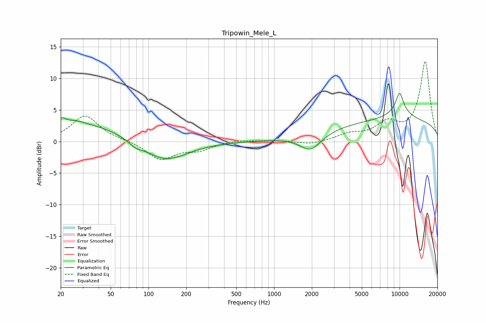

# Tripowin_Mele_L
See [usage instructions](https://github.com/jaakkopasanen/AutoEq#usage) for more options and info.

### Parametric EQs
Apply preamp of -7.7 dB when using parametric equalizer.

|   # | Type    |   Fc (Hz) |    Q |   Gain (dB) |
|-----|---------|-----------|------|-------------|
|   1 | Peaking |        20 | 5.93 |        -2.1 |
|   2 | Peaking |        20 | 6    |         2.6 |
|   3 | Peaking |        22 | 0.28 |         3.1 |
|   4 | Peaking |        26 | 1.92 |         0.4 |
|   5 | Peaking |        78 | 2.79 |        -0.8 |
|   6 | Peaking |       134 | 0.8  |        -3.4 |
|   7 | Peaking |      1956 | 1.65 |        -2.7 |
|   8 | Peaking |      9999 | 0.18 |         3.3 |
|   9 | Peaking |     10000 | 1.42 |         1.5 |
|  10 | Peaking |     10000 | 4.37 |         2.8 |

### Fixed Band EQs
When using fixed band (also called graphic) equalizer, apply preamp of **-12.8 dB** (if available) and set gains manually with these parameters.

|   # | Type    |   Fc (Hz) |    Q |   Gain (dB) |
|-----|---------|-----------|------|-------------|
|   1 | Peaking |        31 | 1.41 |         4.1 |
|   2 | Peaking |        62 | 1.41 |         0.2 |
|   3 | Peaking |       125 | 1.41 |        -2.8 |
|   4 | Peaking |       250 | 1.41 |        -1.2 |
|   5 | Peaking |       500 | 1.41 |         0.3 |
|   6 | Peaking |      1000 | 1.41 |         0.2 |
|   7 | Peaking |      2000 | 1.41 |        -0.5 |
|   8 | Peaking |      4000 | 1.41 |         1   |
|   9 | Peaking |      8000 | 1.41 |         2.6 |
|  10 | Peaking |     16000 | 1.41 |        12.6 |

### Graphs

