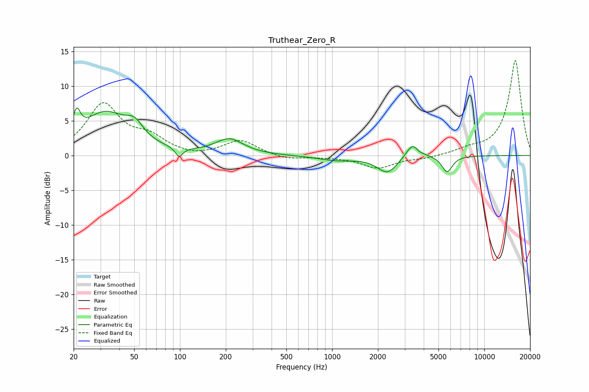

# Truthear_Zero_R
See [usage instructions](https://github.com/jaakkopasanen/AutoEq#usage) for more options and info.

### Parametric EQs
Apply preamp of -6.9 dB when using parametric equalizer.

|   # | Type    |   Fc (Hz) |    Q |   Gain (dB) |
|-----|---------|-----------|------|-------------|
|   1 | Peaking |        21 | 5.94 |         3.2 |
|   2 | Peaking |        32 | 0.92 |         5.9 |
|   3 | Peaking |        50 | 2.56 |         2   |
|   4 | Peaking |        99 | 5.98 |        -1.4 |
|   5 | Peaking |       211 | 1.53 |         2.2 |
|   6 | Peaking |      1069 | 1.14 |        -0.7 |
|   7 | Peaking |      2313 | 2.1  |        -2.5 |
|   8 | Peaking |      3412 | 3.1  |         2.3 |
|   9 | Peaking |      3702 | 5.52 |        -0.5 |
|  10 | Peaking |      5696 | 4.05 |        -2.4 |

### Fixed Band EQs
When using fixed band (also called graphic) equalizer, apply preamp of **-13.8 dB** (if available) and set gains manually with these parameters.

|   # | Type    |   Fc (Hz) |    Q |   Gain (dB) |
|-----|---------|-----------|------|-------------|
|   1 | Peaking |        31 | 1.41 |         7.2 |
|   2 | Peaking |        62 | 1.41 |         2.2 |
|   3 | Peaking |       125 | 1.41 |        -0.3 |
|   4 | Peaking |       250 | 1.41 |         2.2 |
|   5 | Peaking |       500 | 1.41 |        -0.6 |
|   6 | Peaking |      1000 | 1.41 |        -0.2 |
|   7 | Peaking |      2000 | 1.41 |        -1.8 |
|   8 | Peaking |      4000 | 1.41 |        -0.4 |
|   9 | Peaking |      8000 | 1.41 |         0.7 |
|  10 | Peaking |     16000 | 1.41 |        13.7 |

### Graphs

