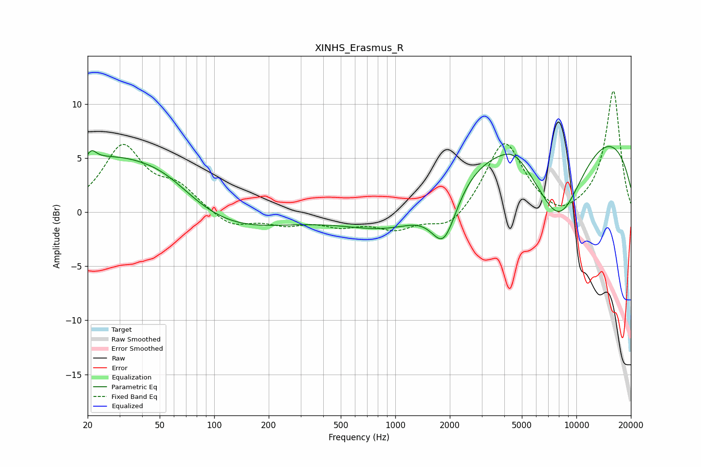

# XINHS_Erasmus_R
See [usage instructions](https://github.com/jaakkopasanen/AutoEq#usage) for more options and info.

### Parametric EQs
Apply preamp of -6.2 dB when using parametric equalizer.

|   # | Type    |   Fc (Hz) |    Q |   Gain (dB) |
|-----|---------|-----------|------|-------------|
|   1 | Peaking |        21 | 5.87 |        -1.7 |
|   2 | Peaking |        21 | 5.5  |         2.6 |
|   3 | Peaking |        27 | 0.46 |         5.4 |
|   4 | Peaking |        54 | 0.76 |         2.5 |
|   5 | Peaking |        81 | 0.37 |        -2.9 |
|   6 | Peaking |      1086 | 0.56 |        -3.4 |
|   7 | Peaking |      1856 | 1.97 |        -5   |
|   8 | Peaking |      4490 | 1.86 |         1.1 |
|   9 | Peaking |      7982 | 0.82 |        -9.9 |
|  10 | Peaking |      8026 | 0.18 |        10.1 |

### Fixed Band EQs
When using fixed band (also called graphic) equalizer, apply preamp of **-11.3 dB** (if available) and set gains manually with these parameters.

|   # | Type    |   Fc (Hz) |    Q |   Gain (dB) |
|-----|---------|-----------|------|-------------|
|   1 | Peaking |        31 | 1.41 |         5.9 |
|   2 | Peaking |        62 | 1.41 |         2.1 |
|   3 | Peaking |       125 | 1.41 |        -1.4 |
|   4 | Peaking |       250 | 1.41 |        -1   |
|   5 | Peaking |       500 | 1.41 |        -1.1 |
|   6 | Peaking |      1000 | 1.41 |        -1.4 |
|   7 | Peaking |      2000 | 1.41 |        -1.7 |
|   8 | Peaking |      4000 | 1.41 |         6.7 |
|   9 | Peaking |      8000 | 1.41 |        -1   |
|  10 | Peaking |     16000 | 1.41 |        11.3 |

### Graphs

