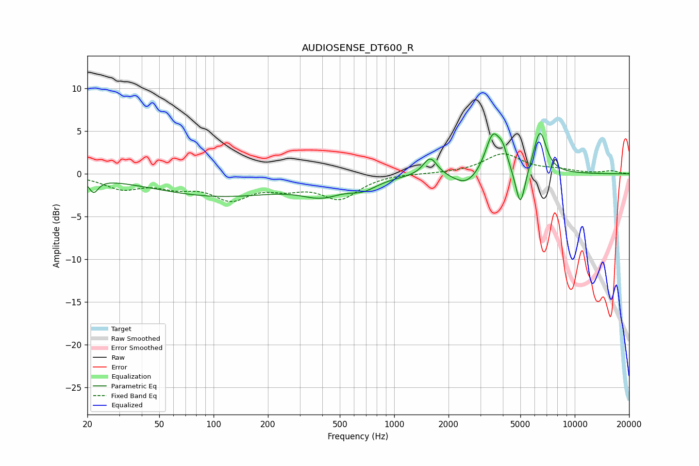

# AUDIOSENSE_DT600_R
See [usage instructions](https://github.com/jaakkopasanen/AutoEq#usage) for more options and info.

### Parametric EQs
Apply preamp of -4.8 dB when using parametric equalizer.

|   # | Type    |   Fc (Hz) |    Q |   Gain (dB) |
|-----|---------|-----------|------|-------------|
|   1 | Peaking |        22 | 5.54 |        -1.6 |
|   2 | Peaking |       107 | 0.38 |        -2.5 |
|   3 | Peaking |       397 | 1.27 |        -1.7 |
|   4 | Peaking |       672 | 1.76 |        -1.2 |
|   5 | Peaking |      1583 | 3.71 |         2.2 |
|   6 | Peaking |      2512 | 2.01 |        -1.6 |
|   7 | Peaking |      3522 | 3.36 |         4.7 |
|   8 | Peaking |      4000 | 5.54 |         1.7 |
|   9 | Peaking |      5001 | 5.29 |        -4.7 |
|  10 | Peaking |      6416 | 3.85 |         5   |

### Fixed Band EQs
When using fixed band (also called graphic) equalizer, apply preamp of **-2.4 dB** (if available) and set gains manually with these parameters.

|   # | Type    |   Fc (Hz) |    Q |   Gain (dB) |
|-----|---------|-----------|------|-------------|
|   1 | Peaking |        31 | 1.41 |        -1.6 |
|   2 | Peaking |        62 | 1.41 |        -1.2 |
|   3 | Peaking |       125 | 1.41 |        -2.6 |
|   4 | Peaking |       250 | 1.41 |        -1.2 |
|   5 | Peaking |       500 | 1.41 |        -2.7 |
|   6 | Peaking |      1000 | 1.41 |         0.1 |
|   7 | Peaking |      2000 | 1.41 |         0   |
|   8 | Peaking |      4000 | 1.41 |         2.3 |
|   9 | Peaking |      8000 | 1.41 |         0.4 |
|  10 | Peaking |     16000 | 1.41 |         0.3 |

### Graphs

