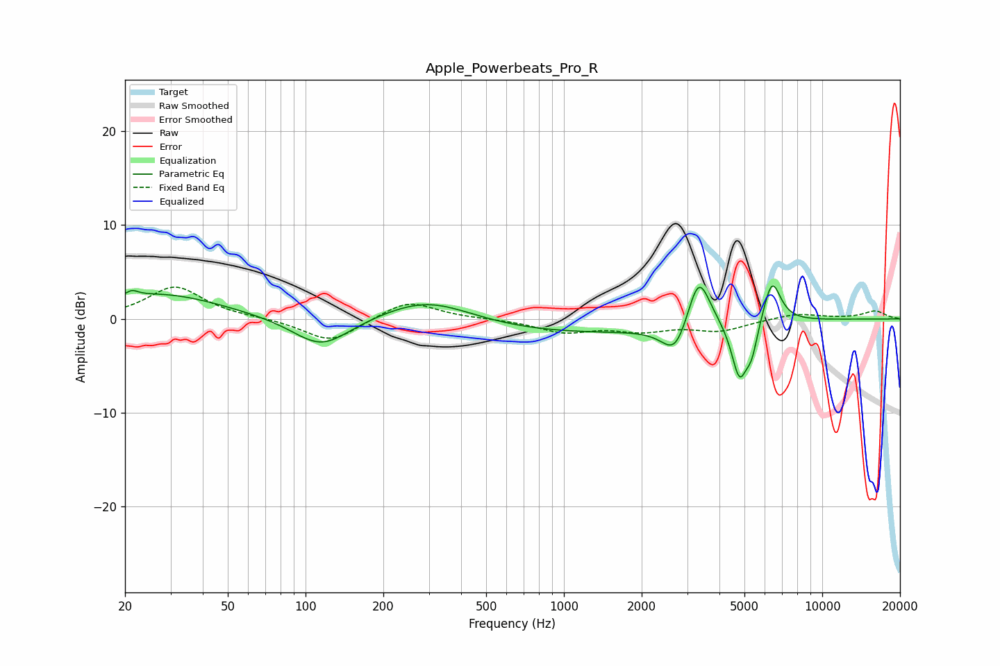

# Apple_Powerbeats_Pro_R
See [usage instructions](https://github.com/jaakkopasanen/AutoEq#usage) for more options and info.

### Parametric EQs
Apply preamp of -3.6 dB when using parametric equalizer.

|   # | Type    |   Fc (Hz) |    Q |   Gain (dB) |
|-----|---------|-----------|------|-------------|
|   1 | Peaking |        21 | 5.85 |         0.6 |
|   2 | Peaking |        27 | 0.59 |         2.7 |
|   3 | Peaking |       115 | 1.27 |        -3.3 |
|   4 | Peaking |       297 | 0.78 |         2.9 |
|   5 | Peaking |       899 | 0.25 |        -1.6 |
|   6 | Peaking |      2706 | 2.72 |        -3.5 |
|   7 | Peaking |      3321 | 3.08 |         6.1 |
|   8 | Peaking |      4782 | 4.47 |        -6   |
|   9 | Peaking |      5340 | 6    |        -2.7 |
|  10 | Peaking |      6390 | 4.04 |         4.7 |

### Fixed Band EQs
When using fixed band (also called graphic) equalizer, apply preamp of **-3.5 dB** (if available) and set gains manually with these parameters.

|   # | Type    |   Fc (Hz) |    Q |   Gain (dB) |
|-----|---------|-----------|------|-------------|
|   1 | Peaking |        31 | 1.41 |         3.4 |
|   2 | Peaking |        62 | 1.41 |         0.1 |
|   3 | Peaking |       125 | 1.41 |        -2.5 |
|   4 | Peaking |       250 | 1.41 |         2   |
|   5 | Peaking |       500 | 1.41 |         0   |
|   6 | Peaking |      1000 | 1.41 |        -1.3 |
|   7 | Peaking |      2000 | 1.41 |        -1.1 |
|   8 | Peaking |      4000 | 1.41 |        -1.2 |
|   9 | Peaking |      8000 | 1.41 |         0.6 |
|  10 | Peaking |     16000 | 1.41 |         0.8 |

### Graphs

