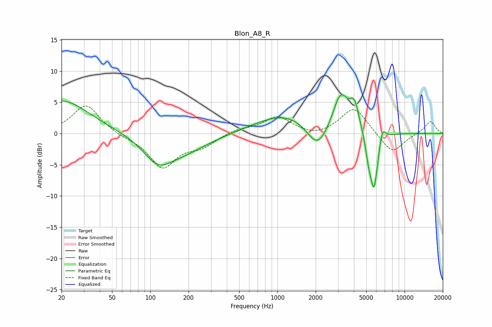

# Blon_A8_R
See [usage instructions](https://github.com/jaakkopasanen/AutoEq#usage) for more options and info.

### Parametric EQs
Apply preamp of -6.3 dB when using parametric equalizer.

|   # | Type    |   Fc (Hz) |    Q |   Gain (dB) |
|-----|---------|-----------|------|-------------|
|   1 | Peaking |        20 | 0.65 |         5.4 |
|   2 | Peaking |       114 | 1.28 |        -3.6 |
|   3 | Peaking |       179 | 0.7  |        -2.6 |
|   4 | Peaking |      1188 | 0.6  |         3.3 |
|   5 | Peaking |      2075 | 1.63 |        -4.5 |
|   6 | Peaking |      3141 | 2.27 |         6.1 |
|   7 | Peaking |      4038 | 3.87 |         3.8 |
|   8 | Peaking |      5197 | 5.99 |        -2.5 |
|   9 | Peaking |      5751 | 4.36 |        -9.3 |
|  10 | Peaking |      6703 | 5.56 |         2.5 |

### Fixed Band EQs
When using fixed band (also called graphic) equalizer, apply preamp of **-4.5 dB** (if available) and set gains manually with these parameters.

|   # | Type    |   Fc (Hz) |    Q |   Gain (dB) |
|-----|---------|-----------|------|-------------|
|   1 | Peaking |        31 | 1.41 |         4.7 |
|   2 | Peaking |        62 | 1.41 |        -0.4 |
|   3 | Peaking |       125 | 1.41 |        -5.3 |
|   4 | Peaking |       250 | 1.41 |        -1.8 |
|   5 | Peaking |       500 | 1.41 |         0.7 |
|   6 | Peaking |      1000 | 1.41 |         2.6 |
|   7 | Peaking |      2000 | 1.41 |        -0.6 |
|   8 | Peaking |      4000 | 1.41 |         4.3 |
|   9 | Peaking |      8000 | 1.41 |        -3.3 |
|  10 | Peaking |     16000 | 1.41 |         2   |

### Graphs

