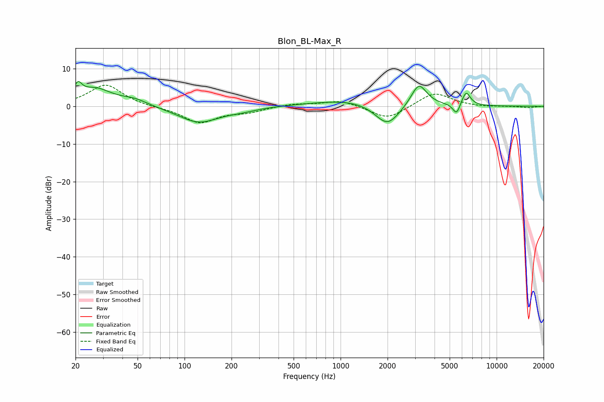

# Blon_BL-Max_R
See [usage instructions](https://github.com/jaakkopasanen/AutoEq#usage) for more options and info.

### Parametric EQs
Apply preamp of -6.7 dB when using parametric equalizer.

|   # | Type    |   Fc (Hz) |    Q |   Gain (dB) |
|-----|---------|-----------|------|-------------|
|   1 | Peaking |        21 | 5.69 |         3.3 |
|   2 | Peaking |        27 | 1.27 |         4.5 |
|   3 | Peaking |        48 | 1.69 |         1.5 |
|   4 | Peaking |       123 | 1.09 |        -4.3 |
|   5 | Peaking |       234 | 1.42 |        -0.7 |
|   6 | Peaking |      1308 | 0.55 |         2.1 |
|   7 | Peaking |      1995 | 1.69 |        -6.5 |
|   8 | Peaking |      3173 | 2.8  |         6.1 |
|   9 | Peaking |      5538 | 5.89 |        -3   |
|  10 | Peaking |      6368 | 4.95 |         3.8 |

### Fixed Band EQs
When using fixed band (also called graphic) equalizer, apply preamp of **-5.7 dB** (if available) and set gains manually with these parameters.

|   # | Type    |   Fc (Hz) |    Q |   Gain (dB) |
|-----|---------|-----------|------|-------------|
|   1 | Peaking |        31 | 1.41 |         5.8 |
|   2 | Peaking |        62 | 1.41 |        -0.2 |
|   3 | Peaking |       125 | 1.41 |        -4.3 |
|   4 | Peaking |       250 | 1.41 |        -1.3 |
|   5 | Peaking |       500 | 1.41 |         0.7 |
|   6 | Peaking |      1000 | 1.41 |         1.6 |
|   7 | Peaking |      2000 | 1.41 |        -3.6 |
|   8 | Peaking |      4000 | 1.41 |         3.8 |
|   9 | Peaking |      8000 | 1.41 |        -0.2 |
|  10 | Peaking |     16000 | 1.41 |        -0.4 |

### Graphs

