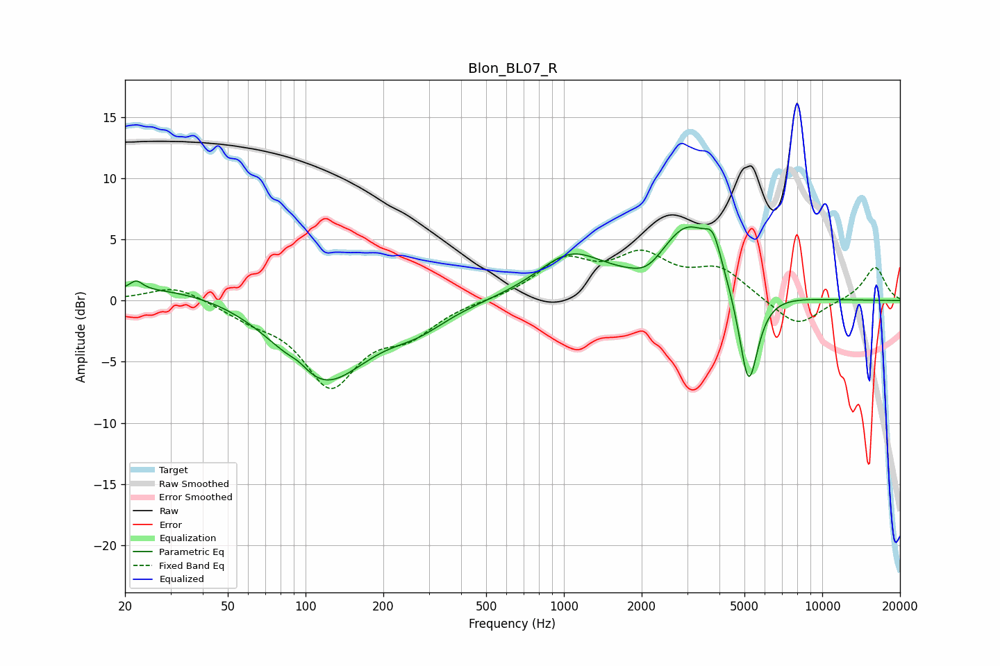

# Blon_BL07_R
See [usage instructions](https://github.com/jaakkopasanen/AutoEq#usage) for more options and info.

### Parametric EQs
Apply preamp of -6.1 dB when using parametric equalizer.

|   # | Type    |   Fc (Hz) |    Q |   Gain (dB) |
|-----|---------|-----------|------|-------------|
|   1 | Peaking |        22 | 5.93 |         0.7 |
|   2 | Peaking |        35 | 0.38 |         1.5 |
|   3 | Peaking |        95 | 3.7  |         0.5 |
|   4 | Peaking |       116 | 0.8  |        -7.1 |
|   5 | Peaking |       273 | 1.31 |        -1.3 |
|   6 | Peaking |      1062 | 1.06 |         3.5 |
|   7 | Peaking |      2102 | 2.35 |        -1   |
|   8 | Peaking |      3021 | 1.28 |         5.8 |
|   9 | Peaking |      3784 | 4.38 |         2.3 |
|  10 | Peaking |      5186 | 3.67 |        -8.3 |

### Fixed Band EQs
When using fixed band (also called graphic) equalizer, apply preamp of **-4.2 dB** (if available) and set gains manually with these parameters.

|   # | Type    |   Fc (Hz) |    Q |   Gain (dB) |
|-----|---------|-----------|------|-------------|
|   1 | Peaking |        31 | 1.41 |         1.3 |
|   2 | Peaking |        62 | 1.41 |        -1.1 |
|   3 | Peaking |       125 | 1.41 |        -6.6 |
|   4 | Peaking |       250 | 1.41 |        -2.3 |
|   5 | Peaking |       500 | 1.41 |         0   |
|   6 | Peaking |      1000 | 1.41 |         3.1 |
|   7 | Peaking |      2000 | 1.41 |         3.2 |
|   8 | Peaking |      4000 | 1.41 |         2.4 |
|   9 | Peaking |      8000 | 1.41 |        -2.3 |
|  10 | Peaking |     16000 | 1.41 |         2.8 |

### Graphs

