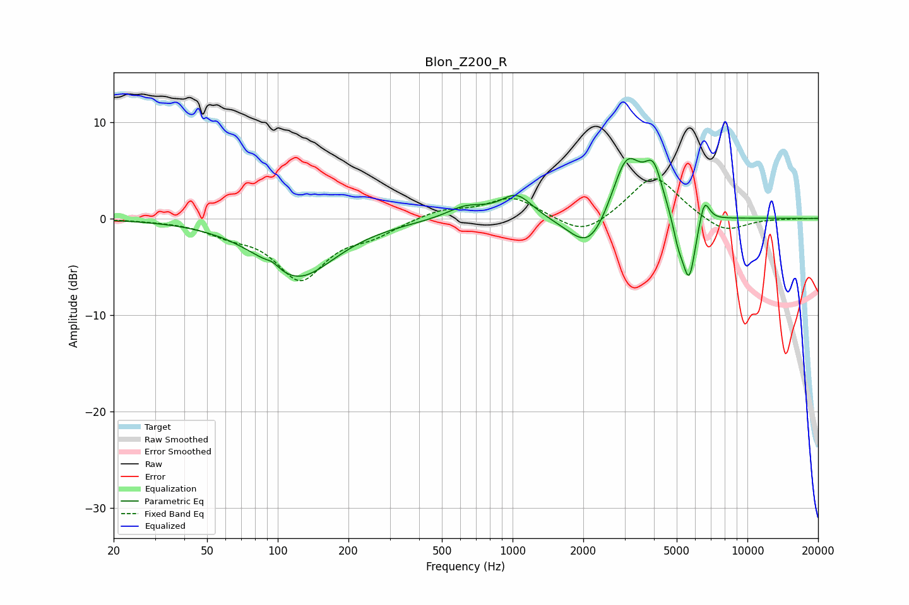

# Blon_Z200_R
See [usage instructions](https://github.com/jaakkopasanen/AutoEq#usage) for more options and info.

### Parametric EQs
Apply preamp of -6.3 dB when using parametric equalizer.

|   # | Type    |   Fc (Hz) |    Q |   Gain (dB) |
|-----|---------|-----------|------|-------------|
|   1 | Peaking |        95 | 5.21 |         0.5 |
|   2 | Peaking |       121 | 0.88 |        -6.1 |
|   3 | Peaking |       634 | 1.71 |         1.3 |
|   4 | Peaking |      1040 | 2.06 |         2.5 |
|   5 | Peaking |      2125 | 1.64 |        -4.1 |
|   6 | Peaking |      3059 | 2.14 |         6.9 |
|   7 | Peaking |      3984 | 3.6  |         4.2 |
|   8 | Peaking |      5074 | 5.97 |        -2.1 |
|   9 | Peaking |      5644 | 4.79 |        -6.8 |
|  10 | Peaking |      6549 | 6    |         2.8 |

### Fixed Band EQs
When using fixed band (also called graphic) equalizer, apply preamp of **-4.2 dB** (if available) and set gains manually with these parameters.

|   # | Type    |   Fc (Hz) |    Q |   Gain (dB) |
|-----|---------|-----------|------|-------------|
|   1 | Peaking |        31 | 1.41 |        -0.1 |
|   2 | Peaking |        62 | 1.41 |        -1.2 |
|   3 | Peaking |       125 | 1.41 |        -6   |
|   4 | Peaking |       250 | 1.41 |        -1.4 |
|   5 | Peaking |       500 | 1.41 |         0.9 |
|   6 | Peaking |      1000 | 1.41 |         2.2 |
|   7 | Peaking |      2000 | 1.41 |        -2   |
|   8 | Peaking |      4000 | 1.41 |         4.6 |
|   9 | Peaking |      8000 | 1.41 |        -1.6 |
|  10 | Peaking |     16000 | 1.41 |        -0   |

### Graphs

