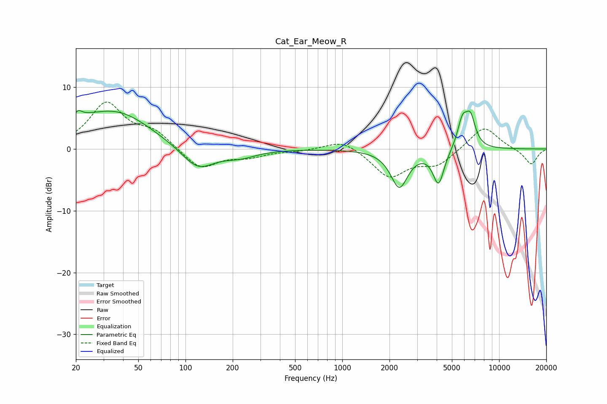

# Cat_Ear_Meow_R
See [usage instructions](https://github.com/jaakkopasanen/AutoEq#usage) for more options and info.

### Parametric EQs
Apply preamp of -6.3 dB when using parametric equalizer.

|   # | Type    |   Fc (Hz) |    Q |   Gain (dB) |
|-----|---------|-----------|------|-------------|
|   1 | Peaking |        21 | 5.58 |         3.4 |
|   2 | Peaking |        21 | 5.78 |        -2.1 |
|   3 | Peaking |        22 | 0.96 |         1.9 |
|   4 | Peaking |        38 | 0.67 |         5.3 |
|   5 | Peaking |       120 | 1.35 |        -3.7 |
|   6 | Peaking |       223 | 1.34 |        -1.2 |
|   7 | Peaking |      2310 | 2.58 |        -6.1 |
|   8 | Peaking |      4111 | 3.96 |        -5.6 |
|   9 | Peaking |      5837 | 4.26 |         4.4 |
|  10 | Peaking |      6574 | 4.33 |         4.5 |

### Fixed Band EQs
When using fixed band (also called graphic) equalizer, apply preamp of **-7.7 dB** (if available) and set gains manually with these parameters.

|   # | Type    |   Fc (Hz) |    Q |   Gain (dB) |
|-----|---------|-----------|------|-------------|
|   1 | Peaking |        31 | 1.41 |         7.2 |
|   2 | Peaking |        62 | 1.41 |         2.5 |
|   3 | Peaking |       125 | 1.41 |        -3.4 |
|   4 | Peaking |       250 | 1.41 |        -1.1 |
|   5 | Peaking |       500 | 1.41 |        -0.3 |
|   6 | Peaking |      1000 | 1.41 |         1.7 |
|   7 | Peaking |      2000 | 1.41 |        -4.5 |
|   8 | Peaking |      4000 | 1.41 |        -2.5 |
|   9 | Peaking |      8000 | 1.41 |         3.8 |
|  10 | Peaking |     16000 | 1.41 |        -2.6 |

### Graphs

