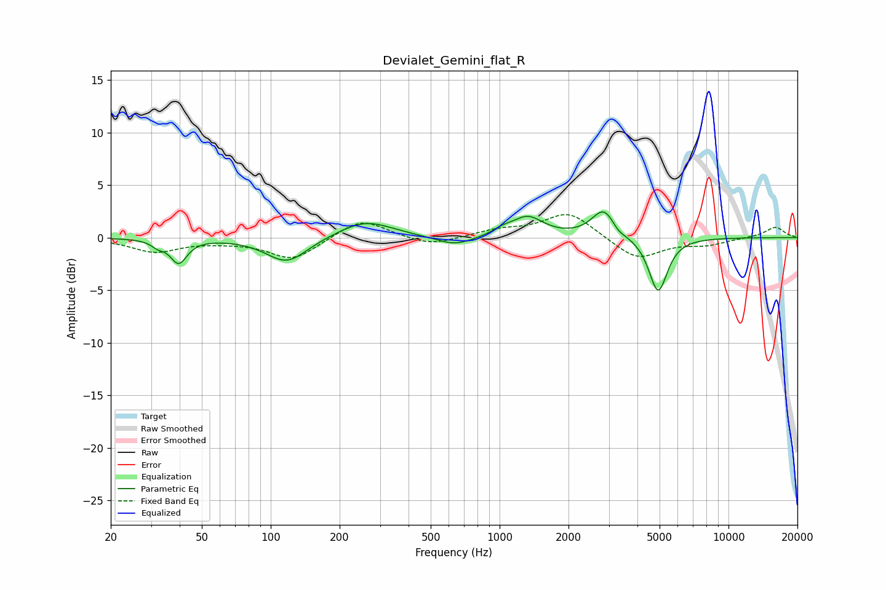

# Devialet_Gemini_flat_R
See [usage instructions](https://github.com/jaakkopasanen/AutoEq#usage) for more options and info.

### Parametric EQs
Apply preamp of -2.5 dB when using parametric equalizer.

|   # | Type    |   Fc (Hz) |    Q |   Gain (dB) |
|-----|---------|-----------|------|-------------|
|   1 | Peaking |        32 | 5.21 |        -0.5 |
|   2 | Peaking |        40 | 3.96 |        -2.3 |
|   3 | Peaking |       118 | 1.57 |        -2.4 |
|   4 | Peaking |       259 | 1.19 |         1.7 |
|   5 | Peaking |       638 | 1.71 |        -0.9 |
|   6 | Peaking |      1030 | 3.1  |         0.4 |
|   7 | Peaking |      1326 | 2.07 |         1.9 |
|   8 | Peaking |      2862 | 2.67 |         2.8 |
|   9 | Peaking |      3286 | 4.81 |        -0.5 |
|  10 | Peaking |      4927 | 3.46 |        -5.3 |

### Fixed Band EQs
When using fixed band (also called graphic) equalizer, apply preamp of **-2.3 dB** (if available) and set gains manually with these parameters.

|   # | Type    |   Fc (Hz) |    Q |   Gain (dB) |
|-----|---------|-----------|------|-------------|
|   1 | Peaking |        31 | 1.41 |        -1.3 |
|   2 | Peaking |        62 | 1.41 |        -0.2 |
|   3 | Peaking |       125 | 1.41 |        -2.1 |
|   4 | Peaking |       250 | 1.41 |         1.9 |
|   5 | Peaking |       500 | 1.41 |        -0.8 |
|   6 | Peaking |      1000 | 1.41 |         0.6 |
|   7 | Peaking |      2000 | 1.41 |         2.4 |
|   8 | Peaking |      4000 | 1.41 |        -2.1 |
|   9 | Peaking |      8000 | 1.41 |        -0.6 |
|  10 | Peaking |     16000 | 1.41 |         1   |

### Graphs

