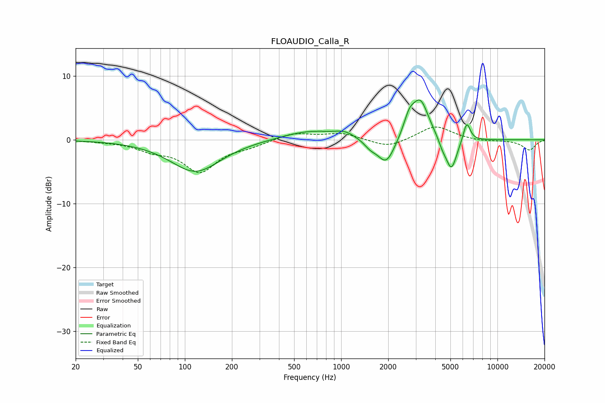

# FLOAUDIO_Calla_R
See [usage instructions](https://github.com/jaakkopasanen/AutoEq#usage) for more options and info.

### Parametric EQs
Apply preamp of -6.3 dB when using parametric equalizer.

|   # | Type    |   Fc (Hz) |    Q |   Gain (dB) |
|-----|---------|-----------|------|-------------|
|   1 | Peaking |       117 | 0.89 |        -5   |
|   2 | Peaking |       639 | 0.78 |         1.5 |
|   3 | Peaking |      1057 | 2.36 |         0.8 |
|   4 | Peaking |      1534 | 3.6  |        -1   |
|   5 | Peaking |      1943 | 2.51 |        -4.2 |
|   6 | Peaking |      2724 | 4    |         2.5 |
|   7 | Peaking |      3213 | 2.56 |         6.1 |
|   8 | Peaking |      4446 | 5.43 |        -1   |
|   9 | Peaking |      5069 | 3.83 |        -5.1 |
|  10 | Peaking |      6361 | 5.99 |         3.1 |

### Fixed Band EQs
When using fixed band (also called graphic) equalizer, apply preamp of **-2.1 dB** (if available) and set gains manually with these parameters.

|   # | Type    |   Fc (Hz) |    Q |   Gain (dB) |
|-----|---------|-----------|------|-------------|
|   1 | Peaking |        31 | 1.41 |        -0.2 |
|   2 | Peaking |        62 | 1.41 |        -1.3 |
|   3 | Peaking |       125 | 1.41 |        -4.8 |
|   4 | Peaking |       250 | 1.41 |        -0.8 |
|   5 | Peaking |       500 | 1.41 |         1.1 |
|   6 | Peaking |      1000 | 1.41 |         1   |
|   7 | Peaking |      2000 | 1.41 |        -1.3 |
|   8 | Peaking |      4000 | 1.41 |         2.2 |
|   9 | Peaking |      8000 | 1.41 |        -0.3 |
|  10 | Peaking |     16000 | 1.41 |        -1.6 |

### Graphs

