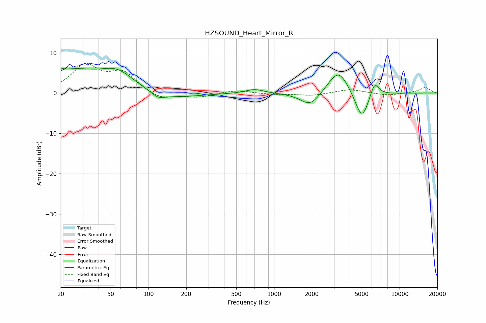

# HZSOUND_Heart_Mirror_R
See [usage instructions](https://github.com/jaakkopasanen/AutoEq#usage) for more options and info.

### Parametric EQs
Apply preamp of -6.2 dB when using parametric equalizer.

|   # | Type    |   Fc (Hz) |    Q |   Gain (dB) |
|-----|---------|-----------|------|-------------|
|   1 | Peaking |        20 | 5.62 |         0.8 |
|   2 | Peaking |        24 | 0.72 |         5   |
|   3 | Peaking |        56 | 1.01 |         4.7 |
|   4 | Peaking |       119 | 2.77 |        -1.2 |
|   5 | Peaking |       143 | 0.66 |        -1.5 |
|   6 | Peaking |       700 | 2    |         1   |
|   7 | Peaking |      1949 | 1.76 |        -3.6 |
|   8 | Peaking |      3269 | 1.64 |         6.4 |
|   9 | Peaking |      5013 | 2.37 |        -7.6 |
|  10 | Peaking |      6295 | 3.72 |         4   |

### Fixed Band EQs
When using fixed band (also called graphic) equalizer, apply preamp of **-7.4 dB** (if available) and set gains manually with these parameters.

|   # | Type    |   Fc (Hz) |    Q |   Gain (dB) |
|-----|---------|-----------|------|-------------|
|   1 | Peaking |        31 | 1.41 |         6.5 |
|   2 | Peaking |        62 | 1.41 |         4.7 |
|   3 | Peaking |       125 | 1.41 |        -1.8 |
|   4 | Peaking |       250 | 1.41 |        -1   |
|   5 | Peaking |       500 | 1.41 |         0.8 |
|   6 | Peaking |      1000 | 1.41 |        -0.3 |
|   7 | Peaking |      2000 | 1.41 |        -0.6 |
|   8 | Peaking |      4000 | 1.41 |         1   |
|   9 | Peaking |      8000 | 1.41 |        -0.6 |
|  10 | Peaking |     16000 | 1.41 |         1.4 |

### Graphs

