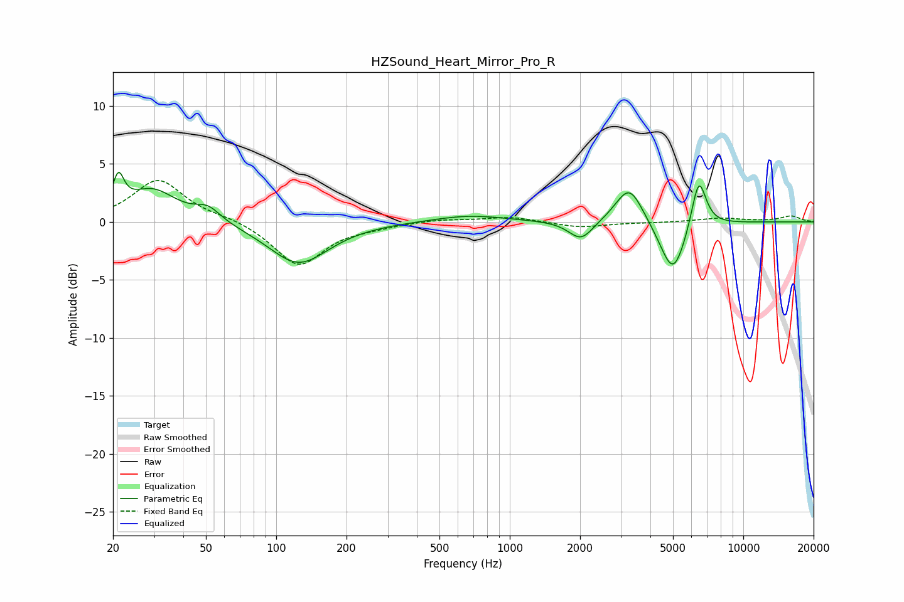

# HZSound_Heart_Mirror_Pro_R
See [usage instructions](https://github.com/jaakkopasanen/AutoEq#usage) for more options and info.

### Parametric EQs
Apply preamp of -4.4 dB when using parametric equalizer.

|   # | Type    |   Fc (Hz) |    Q |   Gain (dB) |
|-----|---------|-----------|------|-------------|
|   1 | Peaking |        21 | 6    |         2.8 |
|   2 | Peaking |        29 | 1.34 |         2.8 |
|   3 | Peaking |        51 | 2.63 |         1.1 |
|   4 | Peaking |       114 | 1.57 |        -0.1 |
|   5 | Peaking |       125 | 1.1  |        -3.5 |
|   6 | Peaking |       668 | 0.93 |         0.6 |
|   7 | Peaking |      2020 | 2.7  |        -1.7 |
|   8 | Peaking |      3250 | 2.39 |         3.3 |
|   9 | Peaking |      5003 | 2.48 |        -4.8 |
|  10 | Peaking |      6445 | 4.28 |         4.5 |

### Fixed Band EQs
When using fixed band (also called graphic) equalizer, apply preamp of **-3.7 dB** (if available) and set gains manually with these parameters.

|   # | Type    |   Fc (Hz) |    Q |   Gain (dB) |
|-----|---------|-----------|------|-------------|
|   1 | Peaking |        31 | 1.41 |         3.6 |
|   2 | Peaking |        62 | 1.41 |         0.3 |
|   3 | Peaking |       125 | 1.41 |        -3.8 |
|   4 | Peaking |       250 | 1.41 |        -0.3 |
|   5 | Peaking |       500 | 1.41 |         0.2 |
|   6 | Peaking |      1000 | 1.41 |         0.4 |
|   7 | Peaking |      2000 | 1.41 |        -0.5 |
|   8 | Peaking |      4000 | 1.41 |        -0.1 |
|   9 | Peaking |      8000 | 1.41 |         0.3 |
|  10 | Peaking |     16000 | 1.41 |         0.5 |

### Graphs

