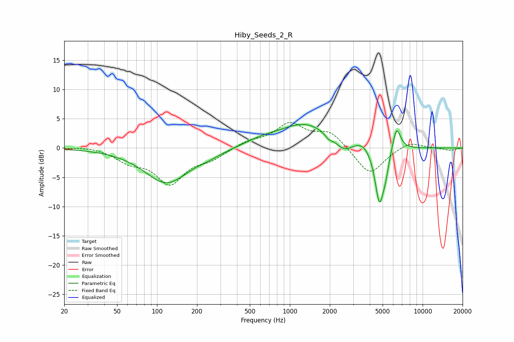

# Hiby_Seeds_2_R
See [usage instructions](https://github.com/jaakkopasanen/AutoEq#usage) for more options and info.

### Parametric EQs
Apply preamp of -4.1 dB when using parametric equalizer.

|   # | Type    |   Fc (Hz) |    Q |   Gain (dB) |
|-----|---------|-----------|------|-------------|
|   1 | Peaking |       118 | 0.85 |        -6   |
|   2 | Peaking |       246 | 1.71 |        -0.5 |
|   3 | Peaking |       603 | 1.15 |         0.8 |
|   4 | Peaking |      1298 | 0.73 |         4.1 |
|   5 | Peaking |      1959 | 5.33 |        -0.7 |
|   6 | Peaking |      2530 | 2.32 |        -1.8 |
|   7 | Peaking |      3561 | 2.62 |         1.1 |
|   8 | Peaking |      4732 | 4.02 |        -9.6 |
|   9 | Peaking |      5267 | 5.99 |        -2.2 |
|  10 | Peaking |      6364 | 4.46 |         4.2 |

### Fixed Band EQs
When using fixed band (also called graphic) equalizer, apply preamp of **-4.5 dB** (if available) and set gains manually with these parameters.

|   # | Type    |   Fc (Hz) |    Q |   Gain (dB) |
|-----|---------|-----------|------|-------------|
|   1 | Peaking |        31 | 1.41 |         0.3 |
|   2 | Peaking |        62 | 1.41 |        -2   |
|   3 | Peaking |       125 | 1.41 |        -5.8 |
|   4 | Peaking |       250 | 1.41 |        -1.6 |
|   5 | Peaking |       500 | 1.41 |         1.1 |
|   6 | Peaking |      1000 | 1.41 |         3.9 |
|   7 | Peaking |      2000 | 1.41 |         2.7 |
|   8 | Peaking |      4000 | 1.41 |        -4.7 |
|   9 | Peaking |      8000 | 1.41 |         1.2 |
|  10 | Peaking |     16000 | 1.41 |        -0.4 |

### Graphs

