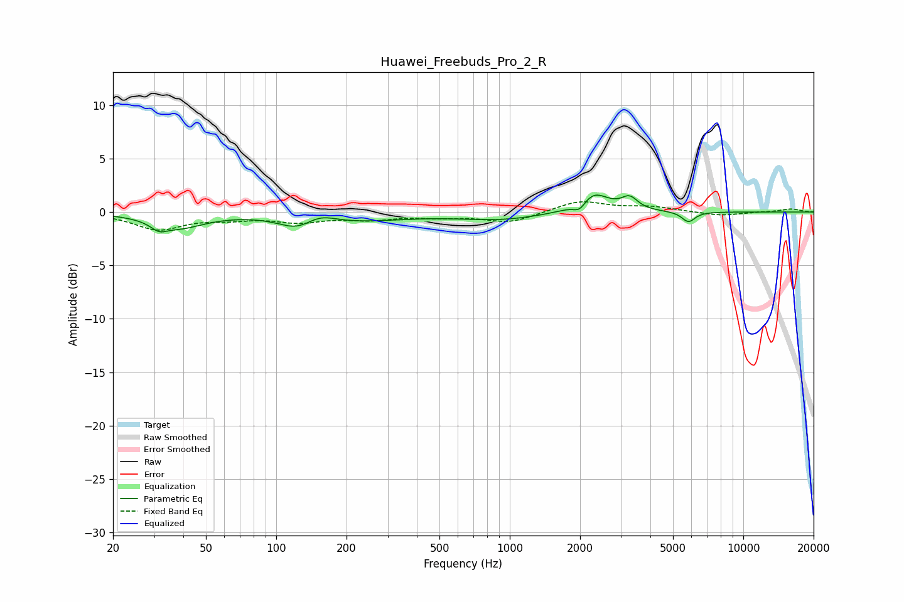

# Huawei_Freebuds_Pro_2_R
See [usage instructions](https://github.com/jaakkopasanen/AutoEq#usage) for more options and info.

### Parametric EQs
Apply preamp of -1.7 dB when using parametric equalizer.

|   # | Type    |   Fc (Hz) |    Q |   Gain (dB) |
|-----|---------|-----------|------|-------------|
|   1 | Peaking |        31 | 4.26 |        -0.7 |
|   2 | Peaking |        38 | 1.27 |        -1.4 |
|   3 | Peaking |       123 | 1.83 |        -1.1 |
|   4 | Peaking |       153 | 2.14 |         0.8 |
|   5 | Peaking |       214 | 0.64 |        -0.8 |
|   6 | Peaking |       913 | 0.79 |        -0.7 |
|   7 | Peaking |      1995 | 5.07 |        -0.9 |
|   8 | Peaking |      2265 | 2.17 |         1.9 |
|   9 | Peaking |      3261 | 4.1  |         1.1 |
|  10 | Peaking |      5823 | 4.96 |        -1   |

### Fixed Band EQs
When using fixed band (also called graphic) equalizer, apply preamp of **-1.1 dB** (if available) and set gains manually with these parameters.

|   # | Type    |   Fc (Hz) |    Q |   Gain (dB) |
|-----|---------|-----------|------|-------------|
|   1 | Peaking |        31 | 1.41 |        -1.6 |
|   2 | Peaking |        62 | 1.41 |        -0.5 |
|   3 | Peaking |       125 | 1.41 |        -0.8 |
|   4 | Peaking |       250 | 1.41 |        -0.6 |
|   5 | Peaking |       500 | 1.41 |        -0.4 |
|   6 | Peaking |      1000 | 1.41 |        -1   |
|   7 | Peaking |      2000 | 1.41 |         1.1 |
|   8 | Peaking |      4000 | 1.41 |         0.5 |
|   9 | Peaking |      8000 | 1.41 |        -0.4 |
|  10 | Peaking |     16000 | 1.41 |         0.3 |

### Graphs

