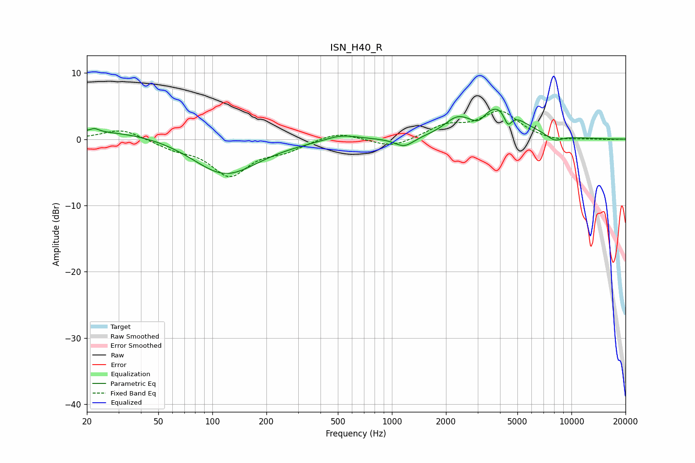

# ISN_H40_R
See [usage instructions](https://github.com/jaakkopasanen/AutoEq#usage) for more options and info.

### Parametric EQs
Apply preamp of -4.6 dB when using parametric equalizer.

|   # | Type    |   Fc (Hz) |    Q |   Gain (dB) |
|-----|---------|-----------|------|-------------|
|   1 | Peaking |        22 | 5.74 |         0.5 |
|   2 | Peaking |        30 | 0.31 |         1.5 |
|   3 | Peaking |       117 | 0.76 |        -5.8 |
|   4 | Peaking |       521 | 1.51 |         0.9 |
|   5 | Peaking |      1174 | 2.62 |        -1.5 |
|   6 | Peaking |      2291 | 2.09 |         2   |
|   7 | Peaking |      3032 | 3.62 |        -1.3 |
|   8 | Peaking |      3941 | 1.23 |         5.1 |
|   9 | Peaking |      4424 | 6    |        -2.4 |
|  10 | Peaking |      8048 | 3    |        -1   |

### Fixed Band EQs
When using fixed band (also called graphic) equalizer, apply preamp of **-4.4 dB** (if available) and set gains manually with these parameters.

|   # | Type    |   Fc (Hz) |    Q |   Gain (dB) |
|-----|---------|-----------|------|-------------|
|   1 | Peaking |        31 | 1.41 |         1.6 |
|   2 | Peaking |        62 | 1.41 |        -1.2 |
|   3 | Peaking |       125 | 1.41 |        -5.3 |
|   4 | Peaking |       250 | 1.41 |        -1.4 |
|   5 | Peaking |       500 | 1.41 |         1.2 |
|   6 | Peaking |      1000 | 1.41 |        -1.3 |
|   7 | Peaking |      2000 | 1.41 |         1.9 |
|   8 | Peaking |      4000 | 1.41 |         4   |
|   9 | Peaking |      8000 | 1.41 |        -0.4 |
|  10 | Peaking |     16000 | 1.41 |        -0.1 |

### Graphs

