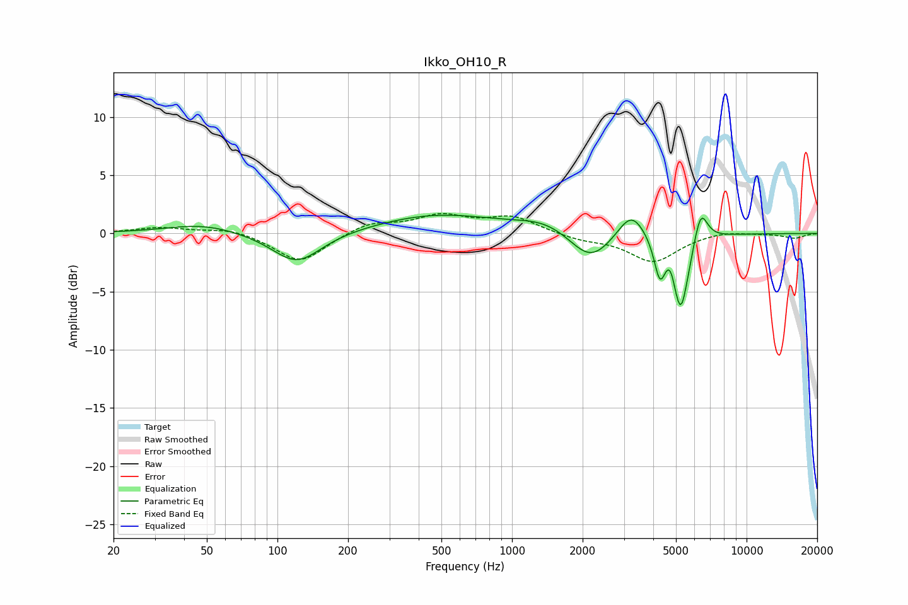

# Ikko_OH10_R
See [usage instructions](https://github.com/jaakkopasanen/AutoEq#usage) for more options and info.

### Parametric EQs
Apply preamp of -1.7 dB when using parametric equalizer.

|   # | Type    |   Fc (Hz) |    Q |   Gain (dB) |
|-----|---------|-----------|------|-------------|
|   1 | Peaking |        48 | 0.92 |         0.8 |
|   2 | Peaking |       121 | 1.35 |        -2.7 |
|   3 | Peaking |       479 | 0.55 |         1.6 |
|   4 | Peaking |      1407 | 1.13 |         1   |
|   5 | Peaking |      2161 | 1.54 |        -2.7 |
|   6 | Peaking |      3228 | 2.39 |         2.4 |
|   7 | Peaking |      4270 | 5.74 |        -3.3 |
|   8 | Peaking |      4736 | 5.88 |         1.4 |
|   9 | Peaking |      5228 | 3.96 |        -6.9 |
|  10 | Peaking |      6374 | 4.68 |         2.9 |

### Fixed Band EQs
When using fixed band (also called graphic) equalizer, apply preamp of **-1.8 dB** (if available) and set gains manually with these parameters.

|   # | Type    |   Fc (Hz) |    Q |   Gain (dB) |
|-----|---------|-----------|------|-------------|
|   1 | Peaking |        31 | 1.41 |         0.5 |
|   2 | Peaking |        62 | 1.41 |         0.5 |
|   3 | Peaking |       125 | 1.41 |        -2.5 |
|   4 | Peaking |       250 | 1.41 |         0.9 |
|   5 | Peaking |       500 | 1.41 |         1.4 |
|   6 | Peaking |      1000 | 1.41 |         1.4 |
|   7 | Peaking |      2000 | 1.41 |        -0.5 |
|   8 | Peaking |      4000 | 1.41 |        -2.4 |
|   9 | Peaking |      8000 | 1.41 |         0.3 |
|  10 | Peaking |     16000 | 1.41 |        -0.4 |

### Graphs

