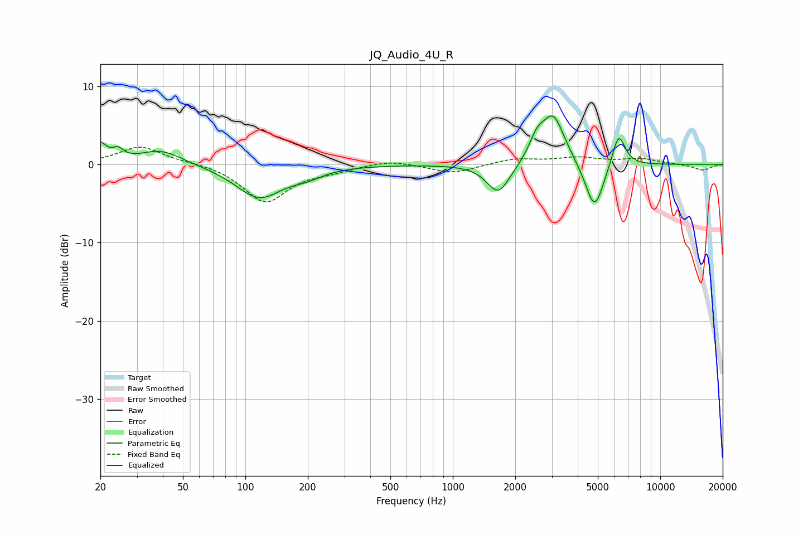

# JQ_Audio_4U_R
See [usage instructions](https://github.com/jaakkopasanen/AutoEq#usage) for more options and info.

### Parametric EQs
Apply preamp of -6.3 dB when using parametric equalizer.

|   # | Type    |   Fc (Hz) |    Q |   Gain (dB) |
|-----|---------|-----------|------|-------------|
|   1 | Peaking |        20 | 4.91 |         2.2 |
|   2 | Peaking |        24 | 5.23 |         1.2 |
|   3 | Peaking |        39 | 1.36 |         1.9 |
|   4 | Peaking |       116 | 1.26 |        -4.2 |
|   5 | Peaking |       199 | 1.79 |        -0.9 |
|   6 | Peaking |      1661 | 2.52 |        -3.9 |
|   7 | Peaking |      2538 | 3.93 |         2.3 |
|   8 | Peaking |      3048 | 2.51 |         6.3 |
|   9 | Peaking |      4822 | 3.12 |        -6.3 |
|  10 | Peaking |      6297 | 4.29 |         4.4 |

### Fixed Band EQs
When using fixed band (also called graphic) equalizer, apply preamp of **-2.3 dB** (if available) and set gains manually with these parameters.

|   # | Type    |   Fc (Hz) |    Q |   Gain (dB) |
|-----|---------|-----------|------|-------------|
|   1 | Peaking |        31 | 1.41 |         2.3 |
|   2 | Peaking |        62 | 1.41 |         0.2 |
|   3 | Peaking |       125 | 1.41 |        -4.8 |
|   4 | Peaking |       250 | 1.41 |        -0.7 |
|   5 | Peaking |       500 | 1.41 |         0.6 |
|   6 | Peaking |      1000 | 1.41 |        -1.1 |
|   7 | Peaking |      2000 | 1.41 |         0.7 |
|   8 | Peaking |      4000 | 1.41 |         0.8 |
|   9 | Peaking |      8000 | 1.41 |         0.7 |
|  10 | Peaking |     16000 | 1.41 |        -0.8 |

### Graphs

