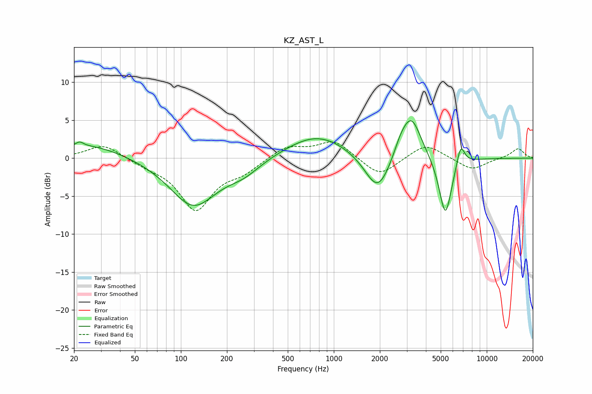

# KZ_AST_L
See [usage instructions](https://github.com/jaakkopasanen/AutoEq#usage) for more options and info.

### Parametric EQs
Apply preamp of -5.0 dB when using parametric equalizer.

|   # | Type    |   Fc (Hz) |    Q |   Gain (dB) |
|-----|---------|-----------|------|-------------|
|   1 | Peaking |        22 | 5.86 |         0.6 |
|   2 | Peaking |        25 | 0.6  |         1.9 |
|   3 | Peaking |       121 | 0.92 |        -6.3 |
|   4 | Peaking |       257 | 1.27 |        -1.5 |
|   5 | Peaking |       779 | 0.69 |         3.2 |
|   6 | Peaking |      1940 | 1.67 |        -5.3 |
|   7 | Peaking |      2718 | 3.3  |         1.2 |
|   8 | Peaking |      3203 | 2.1  |         5.8 |
|   9 | Peaking |      5364 | 3.28 |        -8   |
|  10 | Peaking |      6745 | 5.17 |         2.9 |

### Fixed Band EQs
When using fixed band (also called graphic) equalizer, apply preamp of **-2.2 dB** (if available) and set gains manually with these parameters.

|   # | Type    |   Fc (Hz) |    Q |   Gain (dB) |
|-----|---------|-----------|------|-------------|
|   1 | Peaking |        31 | 1.41 |         1.9 |
|   2 | Peaking |        62 | 1.41 |        -0.7 |
|   3 | Peaking |       125 | 1.41 |        -6.6 |
|   4 | Peaking |       250 | 1.41 |        -1.5 |
|   5 | Peaking |       500 | 1.41 |         1.6 |
|   6 | Peaking |      1000 | 1.41 |         2.3 |
|   7 | Peaking |      2000 | 1.41 |        -2.5 |
|   8 | Peaking |      4000 | 1.41 |         2   |
|   9 | Peaking |      8000 | 1.41 |        -1.6 |
|  10 | Peaking |     16000 | 1.41 |         1.3 |

### Graphs

