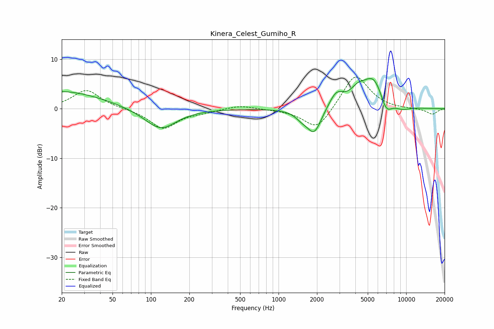

# Kinera_Celest_Gumiho_R
See [usage instructions](https://github.com/jaakkopasanen/AutoEq#usage) for more options and info.

### Parametric EQs
Apply preamp of -6.2 dB when using parametric equalizer.

|   # | Type    |   Fc (Hz) |    Q |   Gain (dB) |
|-----|---------|-----------|------|-------------|
|   1 | Peaking |        20 | 0.44 |         3.6 |
|   2 | Peaking |       109 | 1.66 |         0.5 |
|   3 | Peaking |       117 | 1.17 |        -4.8 |
|   4 | Peaking |      1525 | 2.7  |        -1.2 |
|   5 | Peaking |      1905 | 2.49 |        -5   |
|   6 | Peaking |      2833 | 2.49 |         3   |
|   7 | Peaking |      4159 | 2.52 |         2   |
|   8 | Peaking |      5573 | 1.52 |         6.5 |
|   9 | Peaking |      6947 | 2.84 |        -3.6 |
|  10 | Peaking |      9275 | 1.95 |        -0.9 |

### Fixed Band EQs
When using fixed band (also called graphic) equalizer, apply preamp of **-6.5 dB** (if available) and set gains manually with these parameters.

|   # | Type    |   Fc (Hz) |    Q |   Gain (dB) |
|-----|---------|-----------|------|-------------|
|   1 | Peaking |        31 | 1.41 |         3.8 |
|   2 | Peaking |        62 | 1.41 |        -0   |
|   3 | Peaking |       125 | 1.41 |        -4   |
|   4 | Peaking |       250 | 1.41 |        -0.6 |
|   5 | Peaking |       500 | 1.41 |         0.8 |
|   6 | Peaking |      1000 | 1.41 |        -0.1 |
|   7 | Peaking |      2000 | 1.41 |        -4.5 |
|   8 | Peaking |      4000 | 1.41 |         7.2 |
|   9 | Peaking |      8000 | 1.41 |        -0.1 |
|  10 | Peaking |     16000 | 1.41 |        -1.2 |

### Graphs

