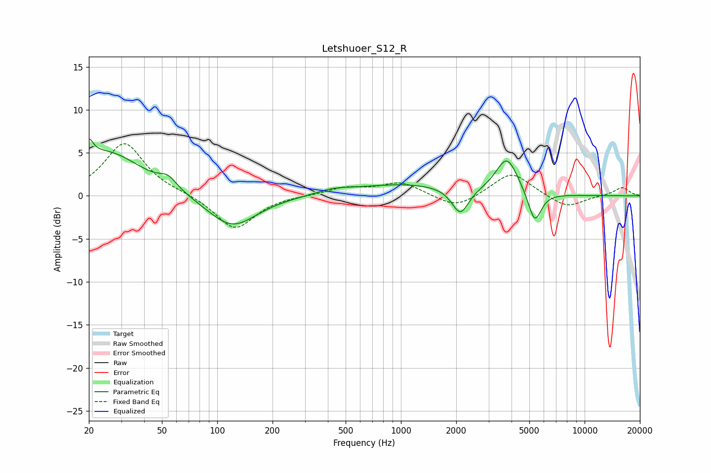

# Letshuoer_S12_R
See [usage instructions](https://github.com/jaakkopasanen/AutoEq#usage) for more options and info.

### Parametric EQs
Apply preamp of -6.7 dB when using parametric equalizer.

|   # | Type    |   Fc (Hz) |    Q |   Gain (dB) |
|-----|---------|-----------|------|-------------|
|   1 | Peaking |        20 | 5.99 |         5.4 |
|   2 | Peaking |        20 | 6    |        -3.3 |
|   3 | Peaking |        25 | 0.73 |         5.1 |
|   4 | Peaking |        54 | 3.03 |         1.2 |
|   5 | Peaking |       120 | 1.05 |        -3.8 |
|   6 | Peaking |       432 | 1.55 |         0.5 |
|   7 | Peaking |      1059 | 0.5  |         1.3 |
|   8 | Peaking |      2105 | 3.13 |        -3.1 |
|   9 | Peaking |      3774 | 2.34 |         4.3 |
|  10 | Peaking |      5352 | 3.89 |        -3.7 |

### Fixed Band EQs
When using fixed band (also called graphic) equalizer, apply preamp of **-6.2 dB** (if available) and set gains manually with these parameters.

|   # | Type    |   Fc (Hz) |    Q |   Gain (dB) |
|-----|---------|-----------|------|-------------|
|   1 | Peaking |        31 | 1.41 |         6.2 |
|   2 | Peaking |        62 | 1.41 |         0.2 |
|   3 | Peaking |       125 | 1.41 |        -4   |
|   4 | Peaking |       250 | 1.41 |         0   |
|   5 | Peaking |       500 | 1.41 |         0.9 |
|   6 | Peaking |      1000 | 1.41 |         1.5 |
|   7 | Peaking |      2000 | 1.41 |        -1.6 |
|   8 | Peaking |      4000 | 1.41 |         2.8 |
|   9 | Peaking |      8000 | 1.41 |        -1.4 |
|  10 | Peaking |     16000 | 1.41 |         1   |

### Graphs

