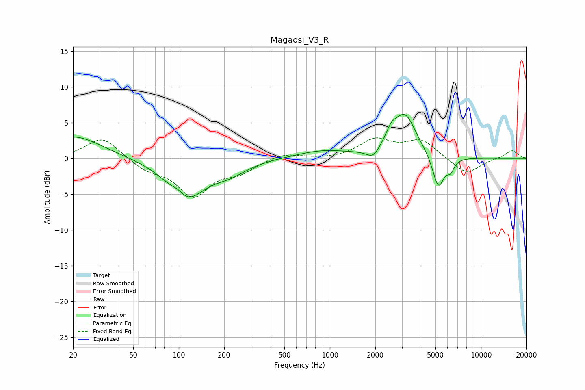

# Magaosi_V3_R
See [usage instructions](https://github.com/jaakkopasanen/AutoEq#usage) for more options and info.

### Parametric EQs
Apply preamp of -6.3 dB when using parametric equalizer.

|   # | Type    |   Fc (Hz) |    Q |   Gain (dB) |
|-----|---------|-----------|------|-------------|
|   1 | Peaking |        20 | 0.76 |         3.2 |
|   2 | Peaking |        99 | 3.51 |         0.9 |
|   3 | Peaking |       111 | 1.14 |        -5.6 |
|   4 | Peaking |       218 | 1.24 |        -1.5 |
|   5 | Peaking |       899 | 0.81 |         1.1 |
|   6 | Peaking |      1929 | 3.38 |        -1.3 |
|   7 | Peaking |      2545 | 3.83 |         1.7 |
|   8 | Peaking |      3138 | 1.86 |         5.9 |
|   9 | Peaking |      5225 | 3.65 |        -4.7 |
|  10 | Peaking |      6291 | 6    |        -1.4 |

### Fixed Band EQs
When using fixed band (also called graphic) equalizer, apply preamp of **-3.0 dB** (if available) and set gains manually with these parameters.

|   # | Type    |   Fc (Hz) |    Q |   Gain (dB) |
|-----|---------|-----------|------|-------------|
|   1 | Peaking |        31 | 1.41 |         3   |
|   2 | Peaking |        62 | 1.41 |        -1.4 |
|   3 | Peaking |       125 | 1.41 |        -5   |
|   4 | Peaking |       250 | 1.41 |        -1.6 |
|   5 | Peaking |       500 | 1.41 |         0.8 |
|   6 | Peaking |      1000 | 1.41 |        -0.2 |
|   7 | Peaking |      2000 | 1.41 |         2.5 |
|   8 | Peaking |      4000 | 1.41 |         2.4 |
|   9 | Peaking |      8000 | 1.41 |        -2.3 |
|  10 | Peaking |     16000 | 1.41 |         1.2 |

### Graphs

