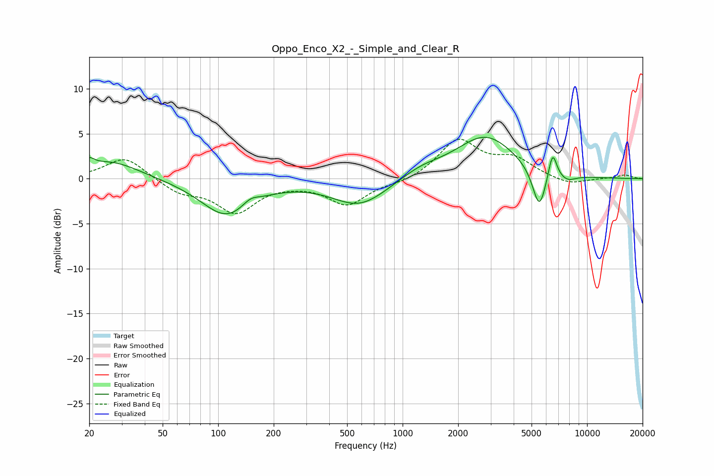

# Oppo_Enco_X2_-_Simple_and_Clear_R
See [usage instructions](https://github.com/jaakkopasanen/AutoEq#usage) for more options and info.

### Parametric EQs
Apply preamp of -4.7 dB when using parametric equalizer.

|   # | Type    |   Fc (Hz) |    Q |   Gain (dB) |
|-----|---------|-----------|------|-------------|
|   1 | Peaking |        20 | 5.37 |         0.9 |
|   2 | Peaking |        26 | 0.91 |         2   |
|   3 | Peaking |       111 | 1.02 |        -4.1 |
|   4 | Peaking |       149 | 3.02 |         0.8 |
|   5 | Peaking |       587 | 0.94 |        -3   |
|   6 | Peaking |      1257 | 1.21 |         1   |
|   7 | Peaking |      2817 | 0.87 |         4.7 |
|   8 | Peaking |      5506 | 3.74 |        -4.6 |
|   9 | Peaking |      6501 | 5.99 |         3   |
|  10 | Peaking |      7809 | 2.82 |        -0.7 |

### Fixed Band EQs
When using fixed band (also called graphic) equalizer, apply preamp of **-4.5 dB** (if available) and set gains manually with these parameters.

|   # | Type    |   Fc (Hz) |    Q |   Gain (dB) |
|-----|---------|-----------|------|-------------|
|   1 | Peaking |        31 | 1.41 |         2.5 |
|   2 | Peaking |        62 | 1.41 |        -1.4 |
|   3 | Peaking |       125 | 1.41 |        -3.6 |
|   4 | Peaking |       250 | 1.41 |        -0.2 |
|   5 | Peaking |       500 | 1.41 |        -2.8 |
|   6 | Peaking |      1000 | 1.41 |        -0.5 |
|   7 | Peaking |      2000 | 1.41 |         4.2 |
|   8 | Peaking |      4000 | 1.41 |         2   |
|   9 | Peaking |      8000 | 1.41 |        -0.7 |
|  10 | Peaking |     16000 | 1.41 |         0.4 |

### Graphs

