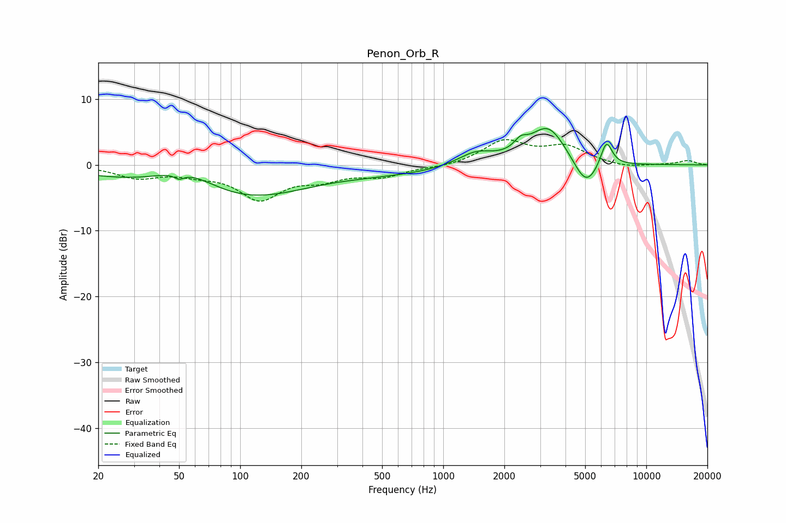

# Penon_Orb_R
See [usage instructions](https://github.com/jaakkopasanen/AutoEq#usage) for more options and info.

### Parametric EQs
Apply preamp of -5.6 dB when using parametric equalizer.

|   # | Type    |   Fc (Hz) |    Q |   Gain (dB) |
|-----|---------|-----------|------|-------------|
|   1 | Peaking |        50 | 5.96 |        -0.8 |
|   2 | Peaking |        55 | 0.74 |         6.1 |
|   3 | Peaking |        73 | 0.37 |        -8   |
|   4 | Peaking |       388 | 1.46 |        -0.2 |
|   5 | Peaking |       661 | 0.75 |        -0.9 |
|   6 | Peaking |      1445 | 1.68 |         1.8 |
|   7 | Peaking |      2404 | 4.47 |         1.4 |
|   8 | Peaking |      3287 | 1.51 |         6   |
|   9 | Peaking |      5048 | 2.21 |        -4.6 |
|  10 | Peaking |      6355 | 4.64 |         4.1 |

### Fixed Band EQs
When using fixed band (also called graphic) equalizer, apply preamp of **-3.9 dB** (if available) and set gains manually with these parameters.

|   # | Type    |   Fc (Hz) |    Q |   Gain (dB) |
|-----|---------|-----------|------|-------------|
|   1 | Peaking |        31 | 1.41 |        -1.8 |
|   2 | Peaking |        62 | 1.41 |        -1   |
|   3 | Peaking |       125 | 1.41 |        -4.9 |
|   4 | Peaking |       250 | 1.41 |        -1.8 |
|   5 | Peaking |       500 | 1.41 |        -1.6 |
|   6 | Peaking |      1000 | 1.41 |        -0.4 |
|   7 | Peaking |      2000 | 1.41 |         3.5 |
|   8 | Peaking |      4000 | 1.41 |         2.6 |
|   9 | Peaking |      8000 | 1.41 |        -0.5 |
|  10 | Peaking |     16000 | 1.41 |         0.6 |

### Graphs

