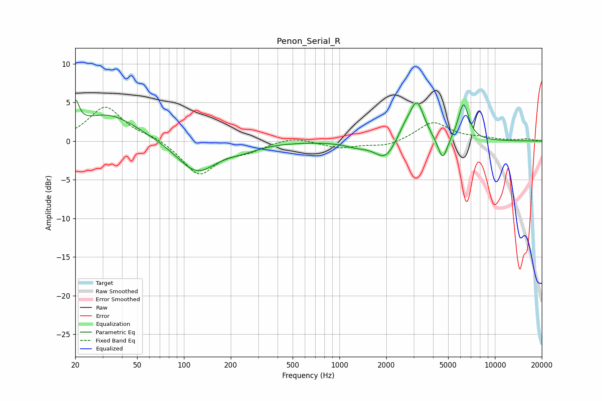

# Penon_Serial_R
See [usage instructions](https://github.com/jaakkopasanen/AutoEq#usage) for more options and info.

### Parametric EQs
Apply preamp of -5.4 dB when using parametric equalizer.

|   # | Type    |   Fc (Hz) |    Q |   Gain (dB) |
|-----|---------|-----------|------|-------------|
|   1 | Peaking |        20 | 6    |         3.2 |
|   2 | Peaking |        32 | 0.75 |         3.5 |
|   3 | Peaking |       120 | 1.12 |        -4.1 |
|   4 | Peaking |       238 | 1.25 |        -0.7 |
|   5 | Peaking |      1294 | 1.79 |        -0.6 |
|   6 | Peaking |      1974 | 2.12 |        -2.5 |
|   7 | Peaking |      2625 | 2.83 |         1.4 |
|   8 | Peaking |      3152 | 3.04 |         4.9 |
|   9 | Peaking |      4610 | 4.48 |        -3.1 |
|  10 | Peaking |      6276 | 4.02 |         4.8 |

### Fixed Band EQs
When using fixed band (also called graphic) equalizer, apply preamp of **-4.5 dB** (if available) and set gains manually with these parameters.

|   # | Type    |   Fc (Hz) |    Q |   Gain (dB) |
|-----|---------|-----------|------|-------------|
|   1 | Peaking |        31 | 1.41 |         4.4 |
|   2 | Peaking |        62 | 1.41 |         0.6 |
|   3 | Peaking |       125 | 1.41 |        -4.3 |
|   4 | Peaking |       250 | 1.41 |        -1.1 |
|   5 | Peaking |       500 | 1.41 |         0.6 |
|   6 | Peaking |      1000 | 1.41 |        -0.9 |
|   7 | Peaking |      2000 | 1.41 |        -0.7 |
|   8 | Peaking |      4000 | 1.41 |         2.5 |
|   9 | Peaking |      8000 | 1.41 |         0.3 |
|  10 | Peaking |     16000 | 1.41 |         0.3 |

### Graphs

