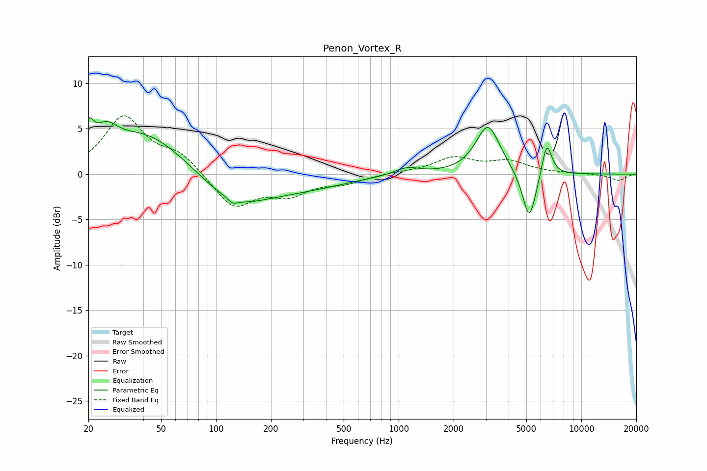

# Penon_Vortex_R
See [usage instructions](https://github.com/jaakkopasanen/AutoEq#usage) for more options and info.

### Parametric EQs
Apply preamp of -6.3 dB when using parametric equalizer.

|   # | Type    |   Fc (Hz) |    Q |   Gain (dB) |
|-----|---------|-----------|------|-------------|
|   1 | Peaking |        20 | 5.57 |         2.7 |
|   2 | Peaking |        25 | 2.36 |         2.3 |
|   3 | Peaking |        41 | 0.6  |         4.8 |
|   4 | Peaking |       123 | 5.82 |        -0.5 |
|   5 | Peaking |       124 | 0.71 |        -3.7 |
|   6 | Peaking |       318 | 0.6  |        -1.1 |
|   7 | Peaking |      1110 | 2.01 |         0.8 |
|   8 | Peaking |      3082 | 2.14 |         5.4 |
|   9 | Peaking |      5191 | 3.66 |        -5.6 |
|  10 | Peaking |      6473 | 4.94 |         3.8 |

### Fixed Band EQs
When using fixed band (also called graphic) equalizer, apply preamp of **-6.5 dB** (if available) and set gains manually with these parameters.

|   # | Type    |   Fc (Hz) |    Q |   Gain (dB) |
|-----|---------|-----------|------|-------------|
|   1 | Peaking |        31 | 1.41 |         6.2 |
|   2 | Peaking |        62 | 1.41 |         2   |
|   3 | Peaking |       125 | 1.41 |        -3.7 |
|   4 | Peaking |       250 | 1.41 |        -2   |
|   5 | Peaking |       500 | 1.41 |        -0.9 |
|   6 | Peaking |      1000 | 1.41 |         0.2 |
|   7 | Peaking |      2000 | 1.41 |         1.7 |
|   8 | Peaking |      4000 | 1.41 |         1.3 |
|   9 | Peaking |      8000 | 1.41 |         0.1 |
|  10 | Peaking |     16000 | 1.41 |        -0.7 |

### Graphs

