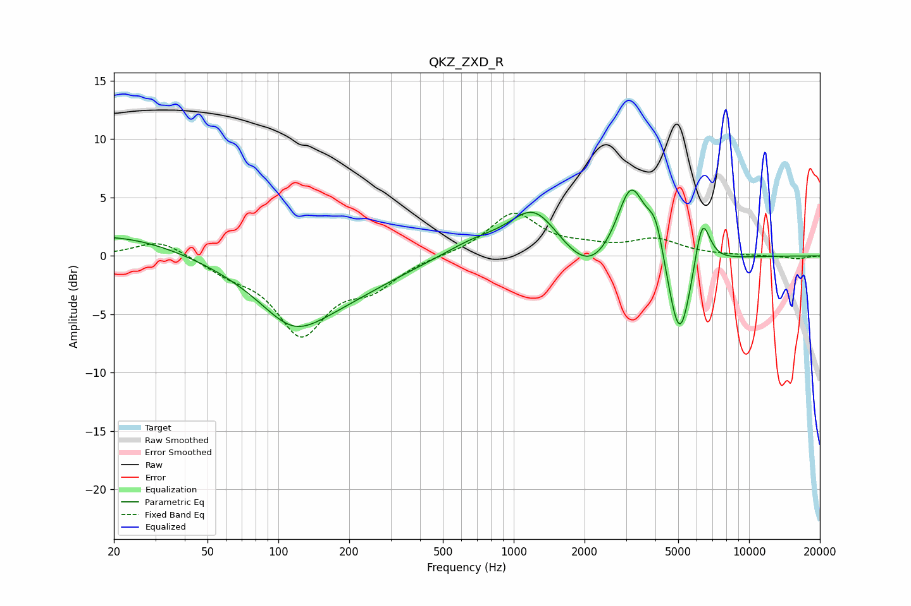

# QKZ_ZXD_R
See [usage instructions](https://github.com/jaakkopasanen/AutoEq#usage) for more options and info.

### Parametric EQs
Apply preamp of -5.7 dB when using parametric equalizer.

|   # | Type    |   Fc (Hz) |    Q |   Gain (dB) |
|-----|---------|-----------|------|-------------|
|   1 | Peaking |        20 | 0.49 |         1.9 |
|   2 | Peaking |       115 | 1.18 |        -2.5 |
|   3 | Peaking |       144 | 0.52 |        -4   |
|   4 | Peaking |       675 | 1.02 |         1.2 |
|   5 | Peaking |      1222 | 1.34 |         4   |
|   6 | Peaking |      2110 | 1.28 |        -2.6 |
|   7 | Peaking |      3150 | 2.24 |         6.7 |
|   8 | Peaking |      4020 | 3.74 |         3.3 |
|   9 | Peaking |      5069 | 2.6  |        -8.5 |
|  10 | Peaking |      6313 | 3.96 |         4.9 |

### Fixed Band EQs
When using fixed band (also called graphic) equalizer, apply preamp of **-3.7 dB** (if available) and set gains manually with these parameters.

|   # | Type    |   Fc (Hz) |    Q |   Gain (dB) |
|-----|---------|-----------|------|-------------|
|   1 | Peaking |        31 | 1.41 |         1.5 |
|   2 | Peaking |        62 | 1.41 |        -1.1 |
|   3 | Peaking |       125 | 1.41 |        -6.4 |
|   4 | Peaking |       250 | 1.41 |        -2.2 |
|   5 | Peaking |       500 | 1.41 |         0   |
|   6 | Peaking |      1000 | 1.41 |         3.6 |
|   7 | Peaking |      2000 | 1.41 |         0.5 |
|   8 | Peaking |      4000 | 1.41 |         1.3 |
|   9 | Peaking |      8000 | 1.41 |         0   |
|  10 | Peaking |     16000 | 1.41 |        -0.3 |

### Graphs

