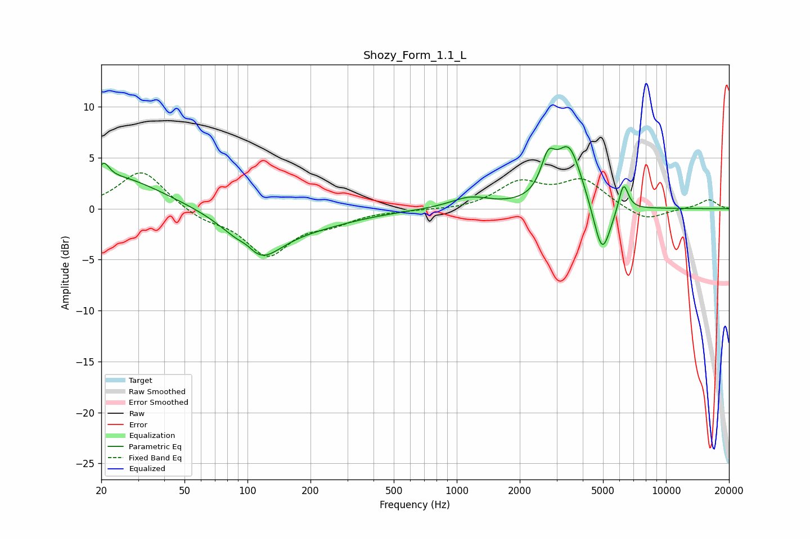

# Shozy_Form_1.1_L
See [usage instructions](https://github.com/jaakkopasanen/AutoEq#usage) for more options and info.

### Parametric EQs
Apply preamp of -6.2 dB when using parametric equalizer.

|   # | Type    |   Fc (Hz) |    Q |   Gain (dB) |
|-----|---------|-----------|------|-------------|
|   1 | Peaking |        21 | 5.7  |         1.5 |
|   2 | Peaking |        23 | 0.65 |         3.2 |
|   3 | Peaking |       100 | 3.25 |         0.8 |
|   4 | Peaking |       111 | 1.23 |        -4.5 |
|   5 | Peaking |       203 | 0.63 |        -1.3 |
|   6 | Peaking |      1158 | 1.5  |         1.1 |
|   7 | Peaking |      2731 | 4.16 |         3.2 |
|   8 | Peaking |      3442 | 2.25 |         5.9 |
|   9 | Peaking |      4952 | 3.35 |        -5.4 |
|  10 | Peaking |      6263 | 6    |         2.9 |

### Fixed Band EQs
When using fixed band (also called graphic) equalizer, apply preamp of **-3.6 dB** (if available) and set gains manually with these parameters.

|   # | Type    |   Fc (Hz) |    Q |   Gain (dB) |
|-----|---------|-----------|------|-------------|
|   1 | Peaking |        31 | 1.41 |         3.9 |
|   2 | Peaking |        62 | 1.41 |        -1   |
|   3 | Peaking |       125 | 1.41 |        -4.4 |
|   4 | Peaking |       250 | 1.41 |        -1.1 |
|   5 | Peaking |       500 | 1.41 |        -0.1 |
|   6 | Peaking |      1000 | 1.41 |        -0.2 |
|   7 | Peaking |      2000 | 1.41 |         2.4 |
|   8 | Peaking |      4000 | 1.41 |         2.7 |
|   9 | Peaking |      8000 | 1.41 |        -1.3 |
|  10 | Peaking |     16000 | 1.41 |         0.9 |

### Graphs

