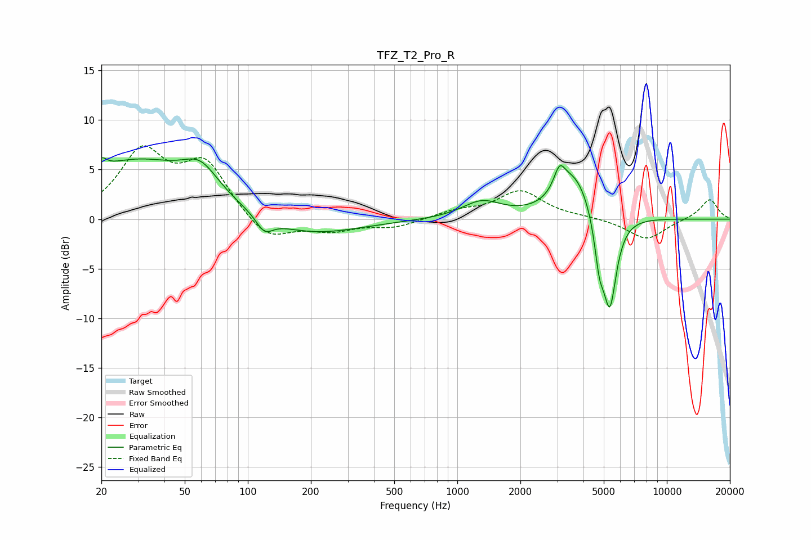

# TFZ_T2_Pro_R
See [usage instructions](https://github.com/jaakkopasanen/AutoEq#usage) for more options and info.

### Parametric EQs
Apply preamp of -6.3 dB when using parametric equalizer.

|   # | Type    |   Fc (Hz) |    Q |   Gain (dB) |
|-----|---------|-----------|------|-------------|
|   1 | Peaking |        20 | 6    |         1.1 |
|   2 | Peaking |        29 | 0.49 |         5.8 |
|   3 | Peaking |        60 | 1.68 |         2.7 |
|   4 | Peaking |       120 | 3.55 |        -1.5 |
|   5 | Peaking |       193 | 0.62 |        -1.8 |
|   6 | Peaking |      1308 | 1.51 |         1.7 |
|   7 | Peaking |      3075 | 5.24 |         2.2 |
|   8 | Peaking |      3623 | 1.65 |         4.6 |
|   9 | Peaking |      4763 | 5.99 |        -4.1 |
|  10 | Peaking |      5343 | 4.23 |        -9.3 |

### Fixed Band EQs
When using fixed band (also called graphic) equalizer, apply preamp of **-7.5 dB** (if available) and set gains manually with these parameters.

|   # | Type    |   Fc (Hz) |    Q |   Gain (dB) |
|-----|---------|-----------|------|-------------|
|   1 | Peaking |        31 | 1.41 |         6.5 |
|   2 | Peaking |        62 | 1.41 |         5.3 |
|   3 | Peaking |       125 | 1.41 |        -2.4 |
|   4 | Peaking |       250 | 1.41 |        -1.1 |
|   5 | Peaking |       500 | 1.41 |        -0.8 |
|   6 | Peaking |      1000 | 1.41 |         0.7 |
|   7 | Peaking |      2000 | 1.41 |         2.8 |
|   8 | Peaking |      4000 | 1.41 |         0.2 |
|   9 | Peaking |      8000 | 1.41 |        -2.1 |
|  10 | Peaking |     16000 | 1.41 |         2.1 |

### Graphs

