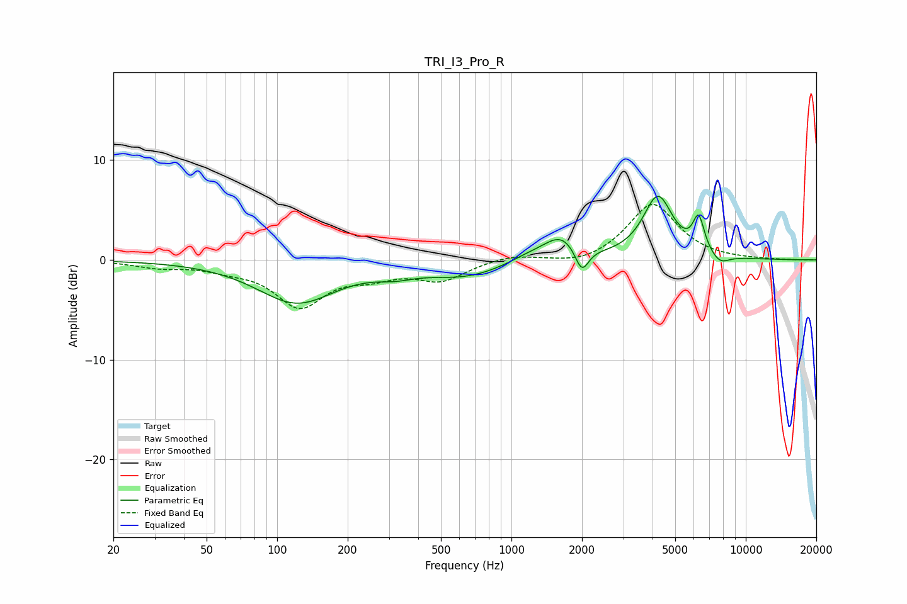

# TRI_I3_Pro_R
See [usage instructions](https://github.com/jaakkopasanen/AutoEq#usage) for more options and info.

### Parametric EQs
Apply preamp of -6.5 dB when using parametric equalizer.

|   # | Type    |   Fc (Hz) |    Q |   Gain (dB) |
|-----|---------|-----------|------|-------------|
|   1 | Peaking |       121 | 0.84 |        -4.2 |
|   2 | Peaking |       318 | 1.72 |        -0.7 |
|   3 | Peaking |       639 | 0.83 |        -1.6 |
|   4 | Peaking |      1211 | 1.53 |         0.7 |
|   5 | Peaking |      1635 | 1.98 |         2.2 |
|   6 | Peaking |      1997 | 4.87 |        -2.5 |
|   7 | Peaking |      4169 | 1.99 |        -0.1 |
|   8 | Peaking |      4216 | 2.21 |         6.4 |
|   9 | Peaking |      6295 | 5.61 |         3.4 |
|  10 | Peaking |      7754 | 3.41 |        -1   |

### Fixed Band EQs
When using fixed band (also called graphic) equalizer, apply preamp of **-5.6 dB** (if available) and set gains manually with these parameters.

|   # | Type    |   Fc (Hz) |    Q |   Gain (dB) |
|-----|---------|-----------|------|-------------|
|   1 | Peaking |        31 | 1.41 |        -0.6 |
|   2 | Peaking |        62 | 1.41 |        -0.7 |
|   3 | Peaking |       125 | 1.41 |        -4.4 |
|   4 | Peaking |       250 | 1.41 |        -1.3 |
|   5 | Peaking |       500 | 1.41 |        -1.9 |
|   6 | Peaking |      1000 | 1.41 |         0.6 |
|   7 | Peaking |      2000 | 1.41 |        -0.6 |
|   8 | Peaking |      4000 | 1.41 |         5.7 |
|   9 | Peaking |      8000 | 1.41 |        -0   |
|  10 | Peaking |     16000 | 1.41 |        -0   |

### Graphs

