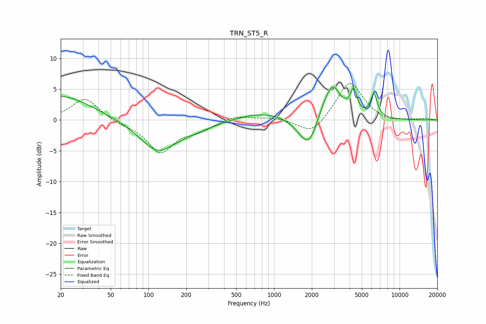

# TRN_ST5_R
See [usage instructions](https://github.com/jaakkopasanen/AutoEq#usage) for more options and info.

### Parametric EQs
Apply preamp of -5.4 dB when using parametric equalizer.

|   # | Type    |   Fc (Hz) |    Q |   Gain (dB) |
|-----|---------|-----------|------|-------------|
|   1 | Peaking |        20 | 0.58 |         4   |
|   2 | Peaking |       118 | 1    |        -4.8 |
|   3 | Peaking |       230 | 0.79 |        -1.1 |
|   4 | Peaking |       814 | 0.65 |         1.3 |
|   5 | Peaking |      1845 | 1.75 |        -4.8 |
|   6 | Peaking |      1989 | 3.27 |        -0.8 |
|   7 | Peaking |      2812 | 1.72 |         5.4 |
|   8 | Peaking |      3014 | 3.78 |         1   |
|   9 | Peaking |      4311 | 5.35 |         3.6 |
|  10 | Peaking |      6248 | 5.22 |         3.7 |

### Fixed Band EQs
When using fixed band (also called graphic) equalizer, apply preamp of **-6.0 dB** (if available) and set gains manually with these parameters.

|   # | Type    |   Fc (Hz) |    Q |   Gain (dB) |
|-----|---------|-----------|------|-------------|
|   1 | Peaking |        31 | 1.41 |         3.6 |
|   2 | Peaking |        62 | 1.41 |        -0.6 |
|   3 | Peaking |       125 | 1.41 |        -5.1 |
|   4 | Peaking |       250 | 1.41 |        -1.4 |
|   5 | Peaking |       500 | 1.41 |         0.8 |
|   6 | Peaking |      1000 | 1.41 |         0.4 |
|   7 | Peaking |      2000 | 1.41 |        -2.5 |
|   8 | Peaking |      4000 | 1.41 |         6.4 |
|   9 | Peaking |      8000 | 1.41 |        -0.5 |
|  10 | Peaking |     16000 | 1.41 |         0.2 |

### Graphs

