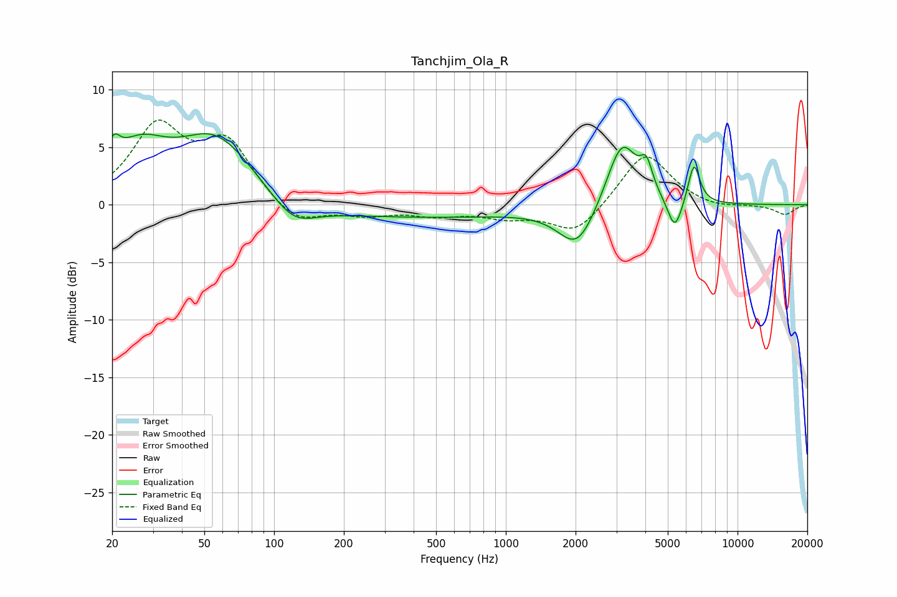

# Tanchjim_Ola_R
See [usage instructions](https://github.com/jaakkopasanen/AutoEq#usage) for more options and info.

### Parametric EQs
Apply preamp of -6.3 dB when using parametric equalizer.

|   # | Type    |   Fc (Hz) |    Q |   Gain (dB) |
|-----|---------|-----------|------|-------------|
|   1 | Peaking |        20 | 5.33 |         2   |
|   2 | Peaking |        26 | 1.16 |         4.1 |
|   3 | Peaking |        56 | 0.83 |         6.2 |
|   4 | Peaking |       121 | 1.51 |        -2.1 |
|   5 | Peaking |       253 | 0.18 |        -1.2 |
|   6 | Peaking |      2035 | 1.74 |        -3.8 |
|   7 | Peaking |      3172 | 2.08 |         6   |
|   8 | Peaking |      4044 | 5.43 |         2.3 |
|   9 | Peaking |      5362 | 4.35 |        -2.9 |
|  10 | Peaking |      6486 | 5.41 |         3.6 |

### Fixed Band EQs
When using fixed band (also called graphic) equalizer, apply preamp of **-7.5 dB** (if available) and set gains manually with these parameters.

|   # | Type    |   Fc (Hz) |    Q |   Gain (dB) |
|-----|---------|-----------|------|-------------|
|   1 | Peaking |        31 | 1.41 |         6.5 |
|   2 | Peaking |        62 | 1.41 |         5.1 |
|   3 | Peaking |       125 | 1.41 |        -1.9 |
|   4 | Peaking |       250 | 1.41 |        -0.8 |
|   5 | Peaking |       500 | 1.41 |        -0.8 |
|   6 | Peaking |      1000 | 1.41 |        -0.9 |
|   7 | Peaking |      2000 | 1.41 |        -2.6 |
|   8 | Peaking |      4000 | 1.41 |         4.7 |
|   9 | Peaking |      8000 | 1.41 |        -0.4 |
|  10 | Peaking |     16000 | 1.41 |        -0.9 |

### Graphs

