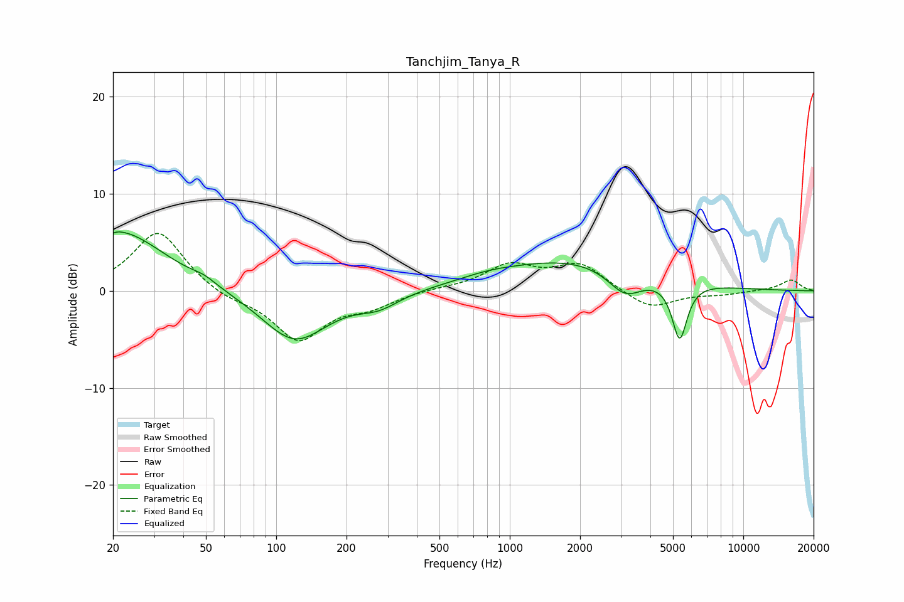

# Tanchjim_Tanya_R
See [usage instructions](https://github.com/jaakkopasanen/AutoEq#usage) for more options and info.

### Parametric EQs
Apply preamp of -6.2 dB when using parametric equalizer.

|   # | Type    |   Fc (Hz) |    Q |   Gain (dB) |
|-----|---------|-----------|------|-------------|
|   1 | Peaking |        20 | 5.98 |        -3   |
|   2 | Peaking |        20 | 5.95 |         3   |
|   3 | Peaking |        21 | 0.72 |         6.2 |
|   4 | Peaking |        49 | 2.88 |         0.5 |
|   5 | Peaking |       120 | 1    |        -5.3 |
|   6 | Peaking |       275 | 1.6  |        -1.3 |
|   7 | Peaking |       805 | 1.22 |         0.4 |
|   8 | Peaking |      1911 | 0.42 |         3.3 |
|   9 | Peaking |      3118 | 1.85 |        -2.7 |
|  10 | Peaking |      5339 | 4.32 |        -5.9 |

### Fixed Band EQs
When using fixed band (also called graphic) equalizer, apply preamp of **-6.0 dB** (if available) and set gains manually with these parameters.

|   # | Type    |   Fc (Hz) |    Q |   Gain (dB) |
|-----|---------|-----------|------|-------------|
|   1 | Peaking |        31 | 1.41 |         6.2 |
|   2 | Peaking |        62 | 1.41 |        -0.8 |
|   3 | Peaking |       125 | 1.41 |        -5   |
|   4 | Peaking |       250 | 1.41 |        -1.4 |
|   5 | Peaking |       500 | 1.41 |         0.2 |
|   6 | Peaking |      1000 | 1.41 |         2.5 |
|   7 | Peaking |      2000 | 1.41 |         2.7 |
|   8 | Peaking |      4000 | 1.41 |        -1.9 |
|   9 | Peaking |      8000 | 1.41 |        -0.3 |
|  10 | Peaking |     16000 | 1.41 |         1.1 |

### Graphs

