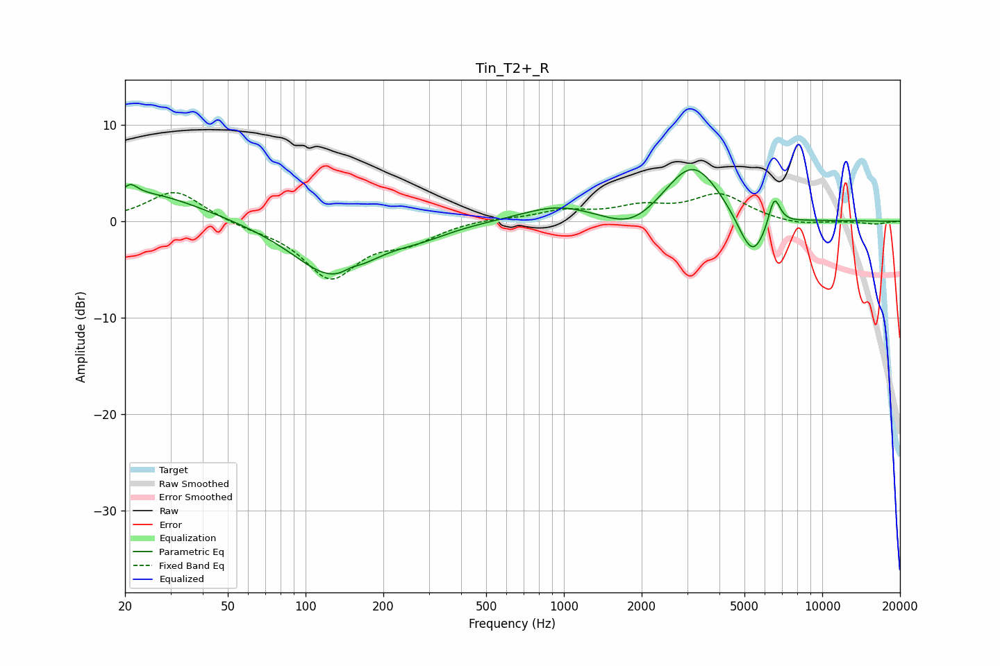

# Tin_T2+_R
See [usage instructions](https://github.com/jaakkopasanen/AutoEq#usage) for more options and info.

### Parametric EQs
Apply preamp of -5.5 dB when using parametric equalizer.

|   # | Type    |   Fc (Hz) |    Q |   Gain (dB) |
|-----|---------|-----------|------|-------------|
|   1 | Peaking |        21 | 5.13 |         1.1 |
|   2 | Peaking |        24 | 0.67 |         3   |
|   3 | Peaking |       128 | 0.92 |        -5.7 |
|   4 | Peaking |       150 | 4.69 |         0.4 |
|   5 | Peaking |       283 | 1.28 |        -0.8 |
|   6 | Peaking |       950 | 0.99 |         1.6 |
|   7 | Peaking |      1847 | 1.32 |        -2.1 |
|   8 | Peaking |      3150 | 1.24 |         6.4 |
|   9 | Peaking |      5366 | 2.41 |        -5   |
|  10 | Peaking |      6518 | 5.8  |         3.3 |

### Fixed Band EQs
When using fixed band (also called graphic) equalizer, apply preamp of **-3.1 dB** (if available) and set gains manually with these parameters.

|   # | Type    |   Fc (Hz) |    Q |   Gain (dB) |
|-----|---------|-----------|------|-------------|
|   1 | Peaking |        31 | 1.41 |         3.3 |
|   2 | Peaking |        62 | 1.41 |        -0.5 |
|   3 | Peaking |       125 | 1.41 |        -5.7 |
|   4 | Peaking |       250 | 1.41 |        -1.7 |
|   5 | Peaking |       500 | 1.41 |         0.3 |
|   6 | Peaking |      1000 | 1.41 |         1   |
|   7 | Peaking |      2000 | 1.41 |         1.3 |
|   8 | Peaking |      4000 | 1.41 |         2.7 |
|   9 | Peaking |      8000 | 1.41 |        -0.5 |
|  10 | Peaking |     16000 | 1.41 |        -0.3 |

### Graphs

