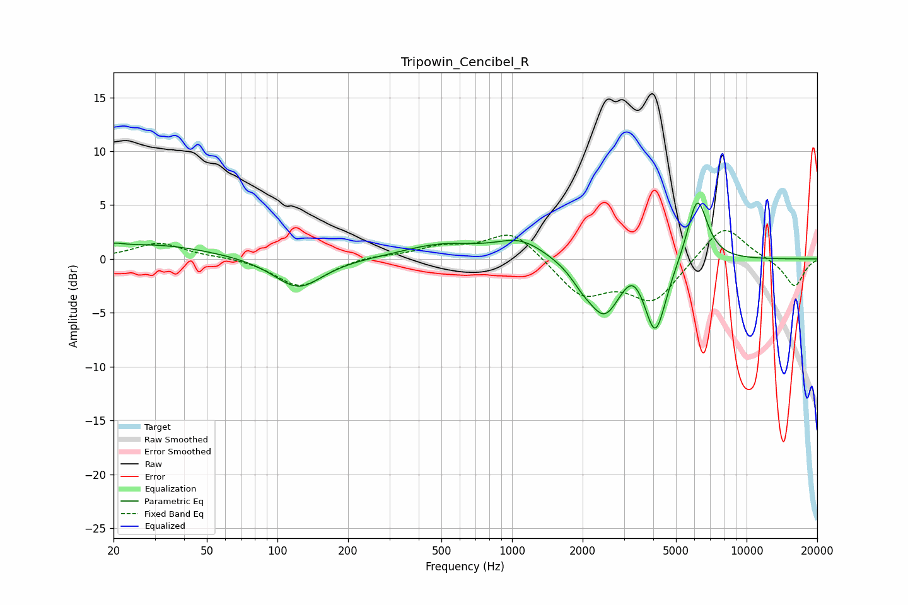

# Tripowin_Cencibel_R
See [usage instructions](https://github.com/jaakkopasanen/AutoEq#usage) for more options and info.

### Parametric EQs
Apply preamp of -5.3 dB when using parametric equalizer.

|   # | Type    |   Fc (Hz) |    Q |   Gain (dB) |
|-----|---------|-----------|------|-------------|
|   1 | Peaking |        20 | 3.73 |         0.4 |
|   2 | Peaking |        29 | 0.55 |         1.3 |
|   3 | Peaking |       123 | 1.37 |        -2.9 |
|   4 | Peaking |       497 | 0.87 |         1.3 |
|   5 | Peaking |      1090 | 1.33 |         1.7 |
|   6 | Peaking |      1983 | 2.97 |        -1   |
|   7 | Peaking |      2478 | 1.99 |        -5   |
|   8 | Peaking |      3288 | 2.8  |         1.7 |
|   9 | Peaking |      4082 | 2.97 |        -6.9 |
|  10 | Peaking |      6162 | 3.16 |         6.2 |

### Fixed Band EQs
When using fixed band (also called graphic) equalizer, apply preamp of **-2.7 dB** (if available) and set gains manually with these parameters.

|   # | Type    |   Fc (Hz) |    Q |   Gain (dB) |
|-----|---------|-----------|------|-------------|
|   1 | Peaking |        31 | 1.41 |         1.5 |
|   2 | Peaking |        62 | 1.41 |         0.2 |
|   3 | Peaking |       125 | 1.41 |        -2.6 |
|   4 | Peaking |       250 | 1.41 |         0.3 |
|   5 | Peaking |       500 | 1.41 |         1   |
|   6 | Peaking |      1000 | 1.41 |         2.7 |
|   7 | Peaking |      2000 | 1.41 |        -3.3 |
|   8 | Peaking |      4000 | 1.41 |        -3.8 |
|   9 | Peaking |      8000 | 1.41 |         3.4 |
|  10 | Peaking |     16000 | 1.41 |        -2.6 |

### Graphs

