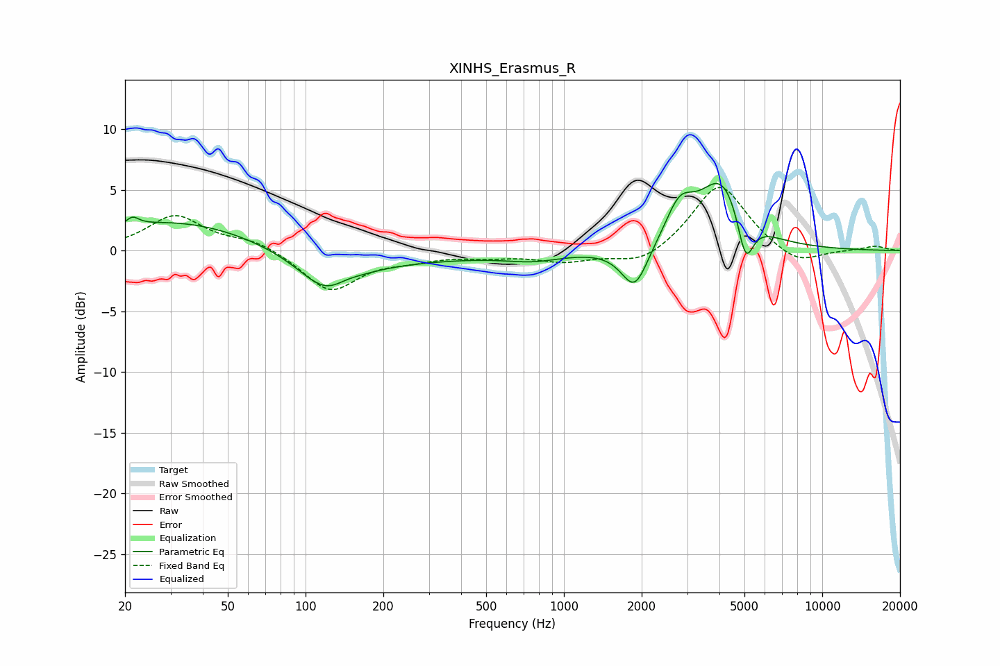

# XINHS_Erasmus_R
See [usage instructions](https://github.com/jaakkopasanen/AutoEq#usage) for more options and info.

### Parametric EQs
Apply preamp of -5.6 dB when using parametric equalizer.

|   # | Type    |   Fc (Hz) |    Q |   Gain (dB) |
|-----|---------|-----------|------|-------------|
|   1 | Peaking |        21 | 5.98 |         0.7 |
|   2 | Peaking |        33 | 0.44 |         2.6 |
|   3 | Peaking |       123 | 1.32 |        -3.2 |
|   4 | Peaking |       142 | 2.34 |         0.6 |
|   5 | Peaking |       168 | 0.37 |        -0.9 |
|   6 | Peaking |       762 | 1.23 |        -0.7 |
|   7 | Peaking |      1881 | 2.73 |        -3.6 |
|   8 | Peaking |      2804 | 2.56 |         3   |
|   9 | Peaking |      4094 | 1.55 |         5.7 |
|  10 | Peaking |      5049 | 4.49 |        -4.1 |

### Fixed Band EQs
When using fixed band (also called graphic) equalizer, apply preamp of **-5.3 dB** (if available) and set gains manually with these parameters.

|   # | Type    |   Fc (Hz) |    Q |   Gain (dB) |
|-----|---------|-----------|------|-------------|
|   1 | Peaking |        31 | 1.41 |         2.8 |
|   2 | Peaking |        62 | 1.41 |         0.8 |
|   3 | Peaking |       125 | 1.41 |        -3.3 |
|   4 | Peaking |       250 | 1.41 |        -0.6 |
|   5 | Peaking |       500 | 1.41 |        -0.4 |
|   6 | Peaking |      1000 | 1.41 |        -0.8 |
|   7 | Peaking |      2000 | 1.41 |        -1.3 |
|   8 | Peaking |      4000 | 1.41 |         5.6 |
|   9 | Peaking |      8000 | 1.41 |        -1.3 |
|  10 | Peaking |     16000 | 1.41 |         0.4 |

### Graphs

