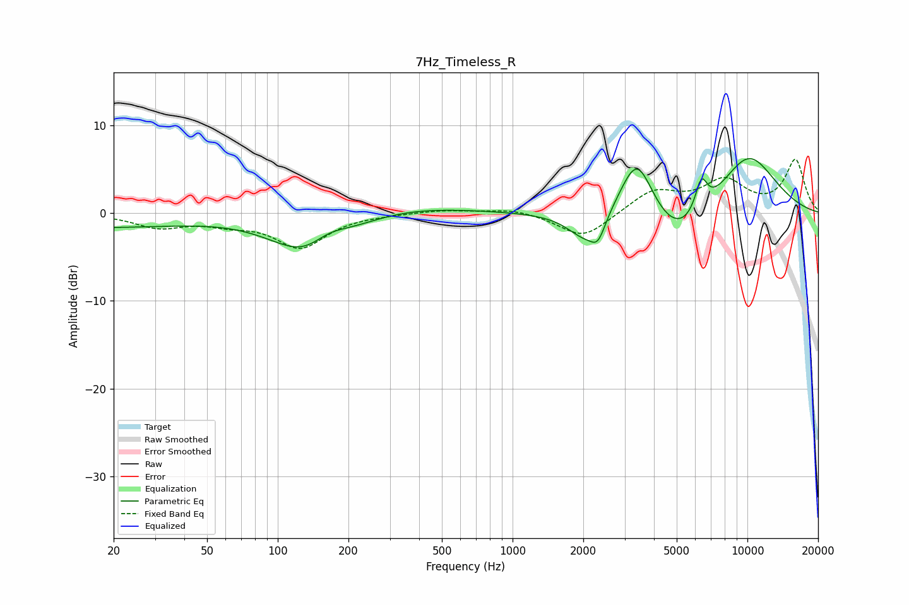

# 7Hz_Timeless_R
See [usage instructions](https://github.com/jaakkopasanen/AutoEq#usage) for more options and info.

### Parametric EQs
Apply preamp of -6.3 dB when using parametric equalizer.

|   # | Type    |   Fc (Hz) |    Q |   Gain (dB) |
|-----|---------|-----------|------|-------------|
|   1 | Peaking |        20 | 0.21 |        -1.8 |
|   2 | Peaking |       142 | 0.79 |        -8.2 |
|   3 | Peaking |       152 | 0.34 |         3   |
|   4 | Peaking |       162 | 1.52 |         2.9 |
|   5 | Peaking |      2044 | 1.84 |        -3.1 |
|   6 | Peaking |      2313 | 4.54 |        -2.2 |
|   7 | Peaking |      3385 | 1.87 |         7.8 |
|   8 | Peaking |      5060 | 0.97 |        -4.9 |
|   9 | Peaking |      6362 | 5.17 |         3.7 |
|  10 | Peaking |     10000 | 0.92 |         7.1 |

### Fixed Band EQs
When using fixed band (also called graphic) equalizer, apply preamp of **-6.2 dB** (if available) and set gains manually with these parameters.

|   # | Type    |   Fc (Hz) |    Q |   Gain (dB) |
|-----|---------|-----------|------|-------------|
|   1 | Peaking |        31 | 1.41 |        -1.5 |
|   2 | Peaking |        62 | 1.41 |        -0.9 |
|   3 | Peaking |       125 | 1.41 |        -3.8 |
|   4 | Peaking |       250 | 1.41 |        -0.1 |
|   5 | Peaking |       500 | 1.41 |         0.4 |
|   6 | Peaking |      1000 | 1.41 |         0.6 |
|   7 | Peaking |      2000 | 1.41 |        -2.9 |
|   8 | Peaking |      4000 | 1.41 |         2.5 |
|   9 | Peaking |      8000 | 1.41 |         3.5 |
|  10 | Peaking |     16000 | 1.41 |         6   |

### Graphs

