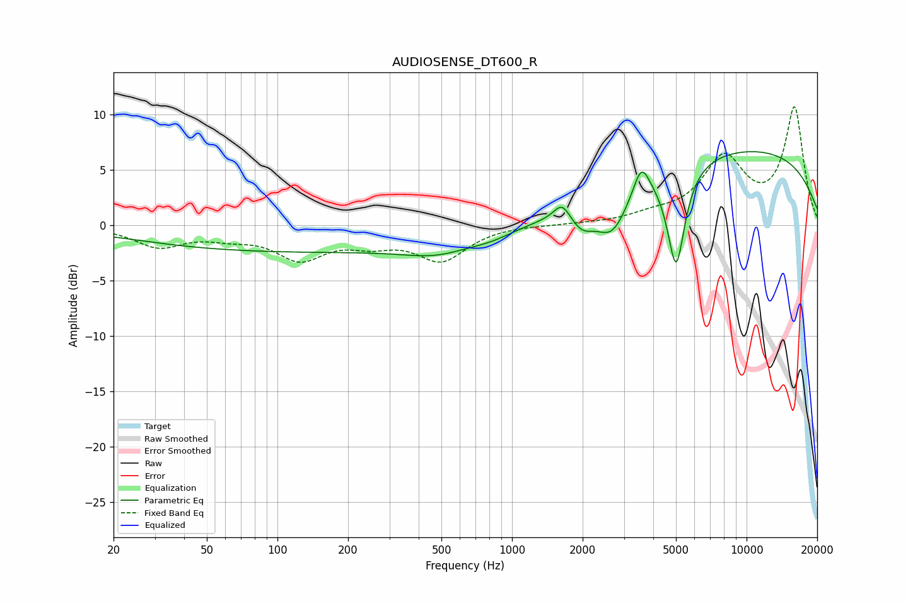

# AUDIOSENSE_DT600_R
See [usage instructions](https://github.com/jaakkopasanen/AutoEq#usage) for more options and info.

### Parametric EQs
Apply preamp of -6.8 dB when using parametric equalizer.

|   # | Type    |   Fc (Hz) |    Q |   Gain (dB) |
|-----|---------|-----------|------|-------------|
|   1 | Peaking |       125 | 0.18 |        -2.3 |
|   2 | Peaking |       479 | 1.01 |        -1.1 |
|   3 | Peaking |       817 | 1.44 |        -0.6 |
|   4 | Peaking |      1634 | 4.16 |         1.5 |
|   5 | Peaking |      1989 | 2.75 |        -1.7 |
|   6 | Peaking |      2672 | 2.02 |        -3.8 |
|   7 | Peaking |      3559 | 4.17 |         2.7 |
|   8 | Peaking |      3961 | 3.09 |         0.1 |
|   9 | Peaking |      5007 | 3.7  |        -9.1 |
|  10 | Peaking |      9339 | 0.23 |         6.9 |

### Fixed Band EQs
When using fixed band (also called graphic) equalizer, apply preamp of **-10.8 dB** (if available) and set gains manually with these parameters.

|   # | Type    |   Fc (Hz) |    Q |   Gain (dB) |
|-----|---------|-----------|------|-------------|
|   1 | Peaking |        31 | 1.41 |        -1.8 |
|   2 | Peaking |        62 | 1.41 |        -0.8 |
|   3 | Peaking |       125 | 1.41 |        -2.8 |
|   4 | Peaking |       250 | 1.41 |        -1.3 |
|   5 | Peaking |       500 | 1.41 |        -3   |
|   6 | Peaking |      1000 | 1.41 |         0.1 |
|   7 | Peaking |      2000 | 1.41 |         0.1 |
|   8 | Peaking |      4000 | 1.41 |         0.7 |
|   9 | Peaking |      8000 | 1.41 |         5.8 |
|  10 | Peaking |     16000 | 1.41 |        10.5 |

### Graphs

