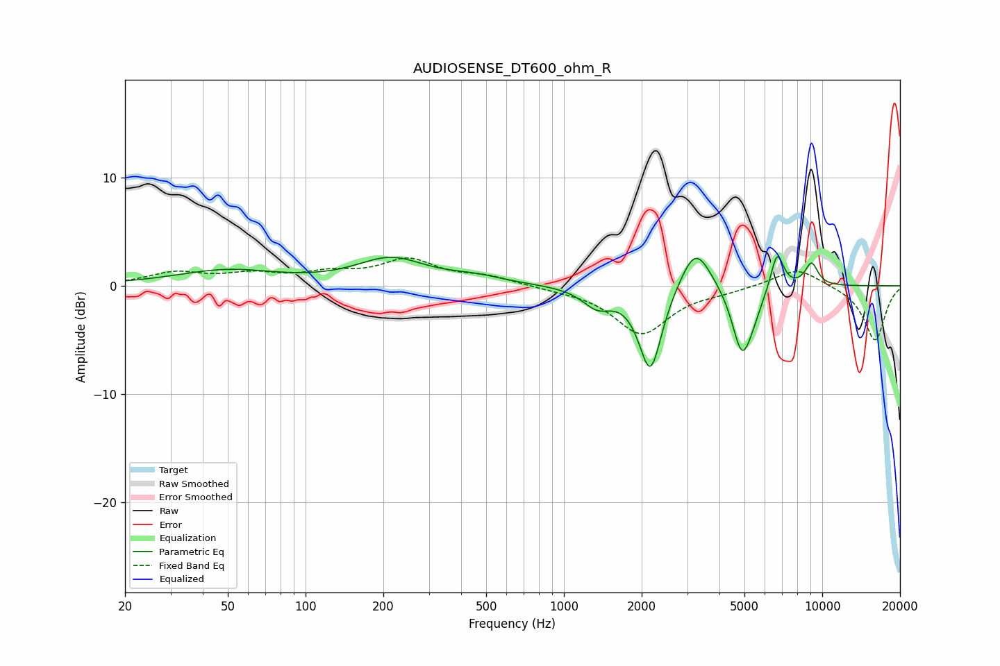

# AUDIOSENSE_DT600_ohm_R
See [usage instructions](https://github.com/jaakkopasanen/AutoEq#usage) for more options and info.

### Parametric EQs
Apply preamp of -2.8 dB when using parametric equalizer.

|   # | Type    |   Fc (Hz) |    Q |   Gain (dB) |
|-----|---------|-----------|------|-------------|
|   1 | Peaking |        50 | 0.72 |         1.4 |
|   2 | Peaking |       214 | 1.06 |         2.4 |
|   3 | Peaking |       454 | 1.26 |         0.6 |
|   4 | Peaking |      1345 | 2.49 |        -1.7 |
|   5 | Peaking |      2161 | 3.14 |        -8   |
|   6 | Peaking |      3229 | 2.34 |         4.2 |
|   7 | Peaking |      4871 | 3.67 |        -5.5 |
|   8 | Peaking |      5314 | 3.26 |        -1.7 |
|   9 | Peaking |      6691 | 5.4  |         3.6 |
|  10 | Peaking |      9089 | 4.97 |         2.1 |

### Fixed Band EQs
When using fixed band (also called graphic) equalizer, apply preamp of **-2.7 dB** (if available) and set gains manually with these parameters.

|   # | Type    |   Fc (Hz) |    Q |   Gain (dB) |
|-----|---------|-----------|------|-------------|
|   1 | Peaking |        31 | 1.41 |         1.1 |
|   2 | Peaking |        62 | 1.41 |         0.9 |
|   3 | Peaking |       125 | 1.41 |         1   |
|   4 | Peaking |       250 | 1.41 |         2.3 |
|   5 | Peaking |       500 | 1.41 |         0.8 |
|   6 | Peaking |      1000 | 1.41 |        -0.2 |
|   7 | Peaking |      2000 | 1.41 |        -4.4 |
|   8 | Peaking |      4000 | 1.41 |        -0.4 |
|   9 | Peaking |      8000 | 1.41 |         1.7 |
|  10 | Peaking |     16000 | 1.41 |        -5.1 |

### Graphs

