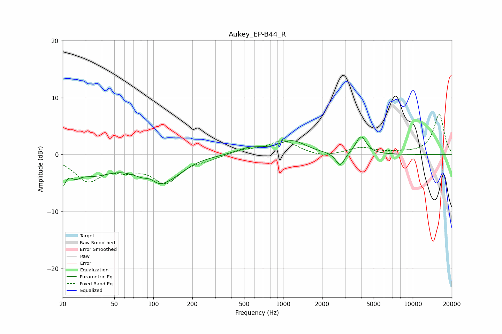

# Aukey_EP-B44_R
See [usage instructions](https://github.com/jaakkopasanen/AutoEq#usage) for more options and info.

### Parametric EQs
Apply preamp of -3.2 dB when using parametric equalizer.

|   # | Type    |   Fc (Hz) |    Q |   Gain (dB) |
|-----|---------|-----------|------|-------------|
|   1 | Peaking |        20 | 5.88 |        -3.4 |
|   2 | Peaking |        25 | 3.8  |        -1.4 |
|   3 | Peaking |        34 | 0.92 |        -3.1 |
|   4 | Peaking |        95 | 2.91 |         1.6 |
|   5 | Peaking |       102 | 1.19 |        -5.1 |
|   6 | Peaking |       149 | 1.41 |        -1.1 |
|   7 | Peaking |       557 | 1.4  |         1.1 |
|   8 | Peaking |      1173 | 1.35 |         2.3 |
|   9 | Peaking |      2761 | 4.2  |        -2.4 |
|  10 | Peaking |      3987 | 3.53 |         3.2 |

### Fixed Band EQs
When using fixed band (also called graphic) equalizer, apply preamp of **-7.1 dB** (if available) and set gains manually with these parameters.

|   # | Type    |   Fc (Hz) |    Q |   Gain (dB) |
|-----|---------|-----------|------|-------------|
|   1 | Peaking |        31 | 1.41 |        -4.3 |
|   2 | Peaking |        62 | 1.41 |        -1.9 |
|   3 | Peaking |       125 | 1.41 |        -4.5 |
|   4 | Peaking |       250 | 1.41 |        -0.6 |
|   5 | Peaking |       500 | 1.41 |         0.8 |
|   6 | Peaking |      1000 | 1.41 |         2.4 |
|   7 | Peaking |      2000 | 1.41 |        -0.6 |
|   8 | Peaking |      4000 | 1.41 |         1.2 |
|   9 | Peaking |      8000 | 1.41 |         0.2 |
|  10 | Peaking |     16000 | 1.41 |         7   |

### Graphs

