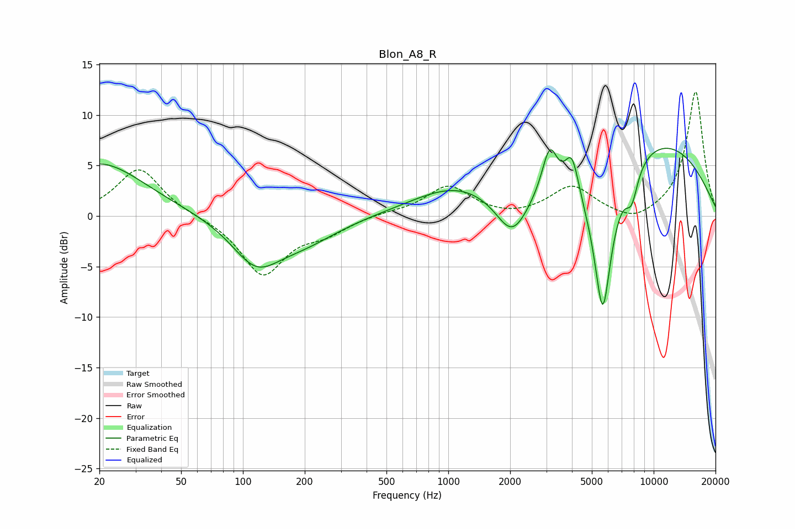

# Blon_A8_R
See [usage instructions](https://github.com/jaakkopasanen/AutoEq#usage) for more options and info.

### Parametric EQs
Apply preamp of -6.8 dB when using parametric equalizer.

|   # | Type    |   Fc (Hz) |    Q |   Gain (dB) |
|-----|---------|-----------|------|-------------|
|   1 | Peaking |        20 | 0.64 |         5.3 |
|   2 | Peaking |       116 | 1.2  |        -4.2 |
|   3 | Peaking |       197 | 0.81 |        -2.2 |
|   4 | Peaking |      1087 | 0.66 |         2.8 |
|   5 | Peaking |      2046 | 1.8  |        -4.2 |
|   6 | Peaking |      3116 | 3.71 |         4.7 |
|   7 | Peaking |      3998 | 4.18 |         3.9 |
|   8 | Peaking |      5650 | 2.86 |       -14.8 |
|   9 | Peaking |      7809 | 4.2  |        -3.1 |
|  10 | Peaking |      9988 | 0.36 |         7.6 |

### Fixed Band EQs
When using fixed band (also called graphic) equalizer, apply preamp of **-12.4 dB** (if available) and set gains manually with these parameters.

|   # | Type    |   Fc (Hz) |    Q |   Gain (dB) |
|-----|---------|-----------|------|-------------|
|   1 | Peaking |        31 | 1.41 |         4.8 |
|   2 | Peaking |        62 | 1.41 |        -0   |
|   3 | Peaking |       125 | 1.41 |        -5.8 |
|   4 | Peaking |       250 | 1.41 |        -1.4 |
|   5 | Peaking |       500 | 1.41 |         0.3 |
|   6 | Peaking |      1000 | 1.41 |         2.9 |
|   7 | Peaking |      2000 | 1.41 |        -0.3 |
|   8 | Peaking |      4000 | 1.41 |         2.9 |
|   9 | Peaking |      8000 | 1.41 |        -1   |
|  10 | Peaking |     16000 | 1.41 |        12.4 |

### Graphs

