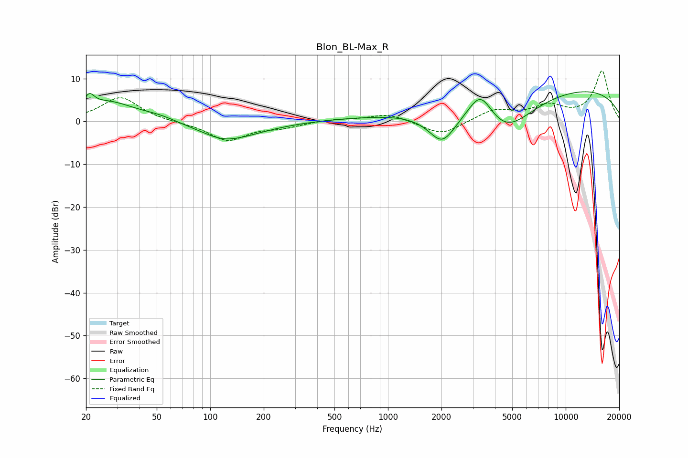

# Blon_BL-Max_R
See [usage instructions](https://github.com/jaakkopasanen/AutoEq#usage) for more options and info.

### Parametric EQs
Apply preamp of -7.0 dB when using parametric equalizer.

|   # | Type    |   Fc (Hz) |    Q |   Gain (dB) |
|-----|---------|-----------|------|-------------|
|   1 | Peaking |        21 | 5.12 |         2.9 |
|   2 | Peaking |        27 | 0.94 |         4.5 |
|   3 | Peaking |        52 | 1.34 |         1.1 |
|   4 | Peaking |       116 | 1.68 |        -0.8 |
|   5 | Peaking |       130 | 0.75 |        -3.8 |
|   6 | Peaking |      1123 | 0.36 |         1   |
|   7 | Peaking |      2020 | 1.78 |        -7.4 |
|   8 | Peaking |      3317 | 1.99 |         7.3 |
|   9 | Peaking |      4559 | 0.85 |        -9.4 |
|  10 | Peaking |      9264 | 0.21 |         8.4 |

### Fixed Band EQs
When using fixed band (also called graphic) equalizer, apply preamp of **-11.9 dB** (if available) and set gains manually with these parameters.

|   # | Type    |   Fc (Hz) |    Q |   Gain (dB) |
|-----|---------|-----------|------|-------------|
|   1 | Peaking |        31 | 1.41 |         5.7 |
|   2 | Peaking |        62 | 1.41 |        -0.2 |
|   3 | Peaking |       125 | 1.41 |        -4.4 |
|   4 | Peaking |       250 | 1.41 |        -1.2 |
|   5 | Peaking |       500 | 1.41 |         0.5 |
|   6 | Peaking |      1000 | 1.41 |         1.8 |
|   7 | Peaking |      2000 | 1.41 |        -3.3 |
|   8 | Peaking |      4000 | 1.41 |         2.6 |
|   9 | Peaking |      8000 | 1.41 |         3.2 |
|  10 | Peaking |     16000 | 1.41 |        11.7 |

### Graphs

