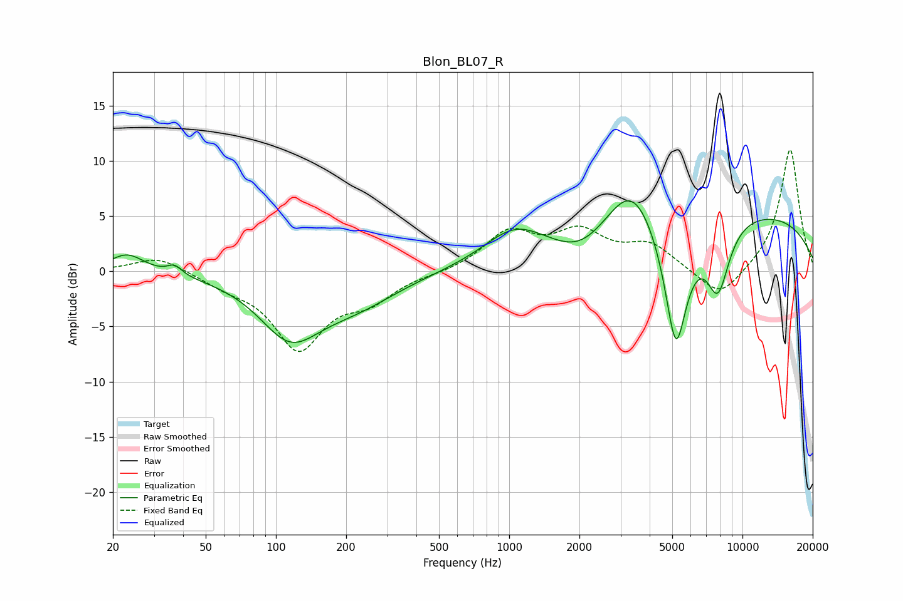

# Blon_BL07_R
See [usage instructions](https://github.com/jaakkopasanen/AutoEq#usage) for more options and info.

### Parametric EQs
Apply preamp of -6.5 dB when using parametric equalizer.

|   # | Type    |   Fc (Hz) |    Q |   Gain (dB) |
|-----|---------|-----------|------|-------------|
|   1 | Peaking |        23 | 1.93 |         1.7 |
|   2 | Peaking |        37 | 4.6  |         0.8 |
|   3 | Peaking |       115 | 1.07 |        -5.3 |
|   4 | Peaking |       220 | 0.75 |        -2.5 |
|   5 | Peaking |      1051 | 1.08 |         2.9 |
|   6 | Peaking |      2043 | 1.15 |        -2.3 |
|   7 | Peaking |      3345 | 1.33 |         4.5 |
|   8 | Peaking |      5182 | 2.64 |       -12.2 |
|   9 | Peaking |      7846 | 2.6  |        -6.2 |
|  10 | Peaking |      8187 | 0.19 |         5.6 |

### Fixed Band EQs
When using fixed band (also called graphic) equalizer, apply preamp of **-11.1 dB** (if available) and set gains manually with these parameters.

|   # | Type    |   Fc (Hz) |    Q |   Gain (dB) |
|-----|---------|-----------|------|-------------|
|   1 | Peaking |        31 | 1.41 |         1.4 |
|   2 | Peaking |        62 | 1.41 |        -1   |
|   3 | Peaking |       125 | 1.41 |        -6.8 |
|   4 | Peaking |       250 | 1.41 |        -2.2 |
|   5 | Peaking |       500 | 1.41 |        -0.2 |
|   6 | Peaking |      1000 | 1.41 |         3.4 |
|   7 | Peaking |      2000 | 1.41 |         3.2 |
|   8 | Peaking |      4000 | 1.41 |         2.2 |
|   9 | Peaking |      8000 | 1.41 |        -2.7 |
|  10 | Peaking |     16000 | 1.41 |        11.2 |

### Graphs

