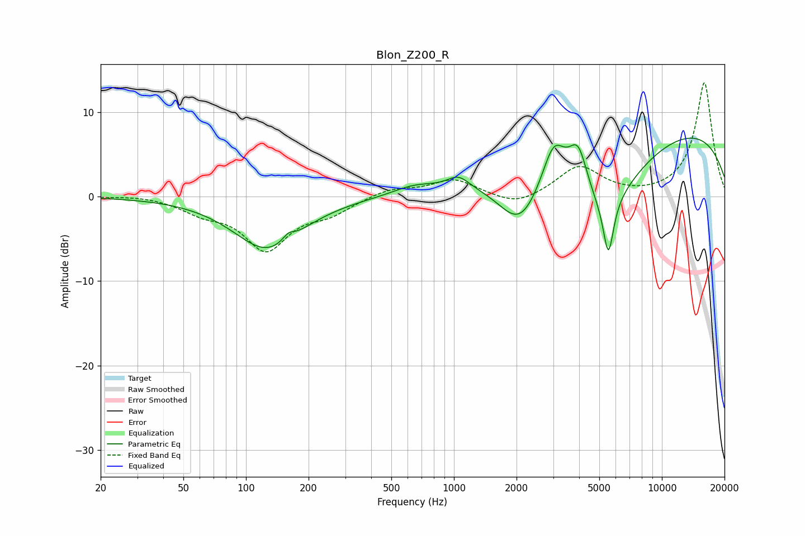

# Blon_Z200_R
See [usage instructions](https://github.com/jaakkopasanen/AutoEq#usage) for more options and info.

### Parametric EQs
Apply preamp of -7.0 dB when using parametric equalizer.

|   # | Type    |   Fc (Hz) |    Q |   Gain (dB) |
|-----|---------|-----------|------|-------------|
|   1 | Peaking |       127 | 0.87 |        -6.2 |
|   2 | Peaking |       160 | 5.05 |         0.9 |
|   3 | Peaking |       643 | 1.4  |         0.9 |
|   4 | Peaking |      1051 | 2.68 |         1.4 |
|   5 | Peaking |      2077 | 1.31 |        -6.3 |
|   6 | Peaking |      3023 | 2.45 |         5.8 |
|   7 | Peaking |      3959 | 2.99 |         5.6 |
|   8 | Peaking |      5141 | 0.73 |        -9.6 |
|   9 | Peaking |      5531 | 5.57 |        -6.7 |
|  10 | Peaking |      8407 | 0.18 |         9.2 |

### Fixed Band EQs
When using fixed band (also called graphic) equalizer, apply preamp of **-13.5 dB** (if available) and set gains manually with these parameters.

|   # | Type    |   Fc (Hz) |    Q |   Gain (dB) |
|-----|---------|-----------|------|-------------|
|   1 | Peaking |        31 | 1.41 |         0.2 |
|   2 | Peaking |        62 | 1.41 |        -1.5 |
|   3 | Peaking |       125 | 1.41 |        -6   |
|   4 | Peaking |       250 | 1.41 |        -1.7 |
|   5 | Peaking |       500 | 1.41 |         1   |
|   6 | Peaking |      1000 | 1.41 |         2   |
|   7 | Peaking |      2000 | 1.41 |        -1.3 |
|   8 | Peaking |      4000 | 1.41 |         3.5 |
|   9 | Peaking |      8000 | 1.41 |        -0.1 |
|  10 | Peaking |     16000 | 1.41 |        13.5 |

### Graphs

