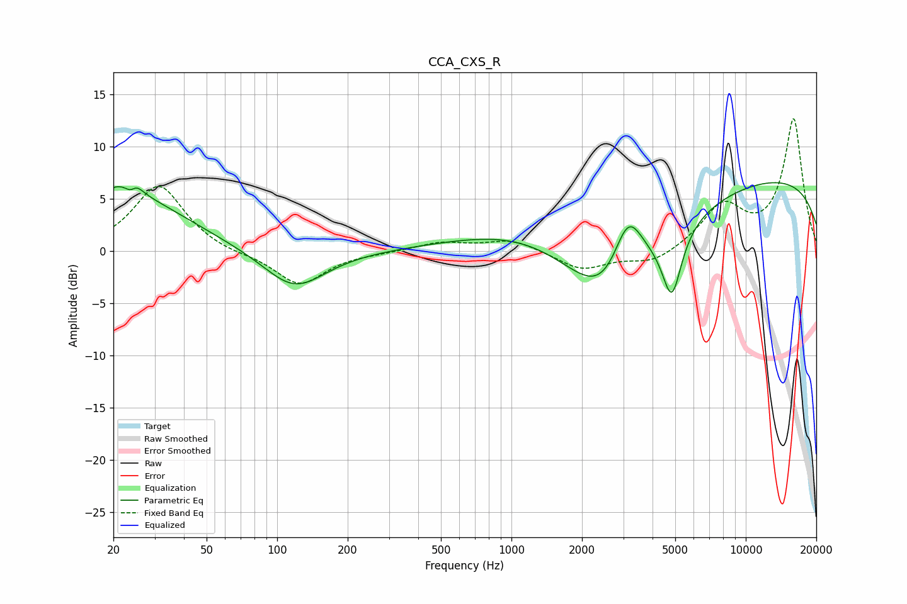

# CCA_CXS_R
See [usage instructions](https://github.com/jaakkopasanen/AutoEq#usage) for more options and info.

### Parametric EQs
Apply preamp of -6.6 dB when using parametric equalizer.

|   # | Type    |   Fc (Hz) |    Q |   Gain (dB) |
|-----|---------|-----------|------|-------------|
|   1 | Peaking |        20 | 3.26 |         1   |
|   2 | Peaking |        24 | 5.56 |        -3.4 |
|   3 | Peaking |        24 | 4.65 |         3.9 |
|   4 | Peaking |        24 | 0.59 |         5.1 |
|   5 | Peaking |       119 | 1.07 |        -3.8 |
|   6 | Peaking |      1345 | 0.46 |         3.6 |
|   7 | Peaking |      2651 | 0.66 |       -12.1 |
|   8 | Peaking |      3139 | 2.02 |         7   |
|   9 | Peaking |      4836 | 3.37 |        -6.3 |
|  10 | Peaking |     10000 | 0.18 |         7.4 |

### Fixed Band EQs
When using fixed band (also called graphic) equalizer, apply preamp of **-12.7 dB** (if available) and set gains manually with these parameters.

|   # | Type    |   Fc (Hz) |    Q |   Gain (dB) |
|-----|---------|-----------|------|-------------|
|   1 | Peaking |        31 | 1.41 |         6.3 |
|   2 | Peaking |        62 | 1.41 |        -0.3 |
|   3 | Peaking |       125 | 1.41 |        -3.3 |
|   4 | Peaking |       250 | 1.41 |        -0.1 |
|   5 | Peaking |       500 | 1.41 |         0.8 |
|   6 | Peaking |      1000 | 1.41 |         1.1 |
|   7 | Peaking |      2000 | 1.41 |        -1.8 |
|   8 | Peaking |      4000 | 1.41 |        -1.3 |
|   9 | Peaking |      8000 | 1.41 |         4.1 |
|  10 | Peaking |     16000 | 1.41 |        12.5 |

### Graphs

