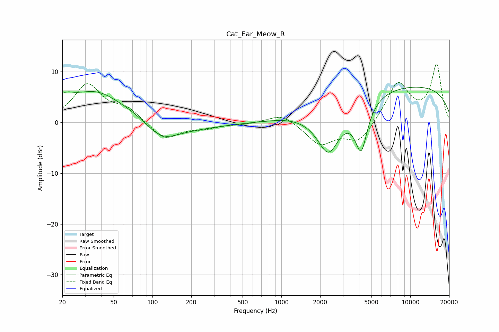

# Cat_Ear_Meow_R
See [usage instructions](https://github.com/jaakkopasanen/AutoEq#usage) for more options and info.

### Parametric EQs
Apply preamp of -7.0 dB when using parametric equalizer.

|   # | Type    |   Fc (Hz) |    Q |   Gain (dB) |
|-----|---------|-----------|------|-------------|
|   1 | Peaking |        20 | 3.41 |         2.7 |
|   2 | Peaking |        20 | 5.61 |        -1.6 |
|   3 | Peaking |        37 | 1.03 |         2   |
|   4 | Peaking |        41 | 0.18 |         4.8 |
|   5 | Peaking |       116 | 1.07 |        -4   |
|   6 | Peaking |       171 | 0.51 |        -3.1 |
|   7 | Peaking |      1064 | 1.25 |         0.2 |
|   8 | Peaking |      2320 | 1.49 |        -9.4 |
|   9 | Peaking |      4160 | 2.77 |        -9.7 |
|  10 | Peaking |      9043 | 0.19 |         7.3 |

### Fixed Band EQs
When using fixed band (also called graphic) equalizer, apply preamp of **-11.6 dB** (if available) and set gains manually with these parameters.

|   # | Type    |   Fc (Hz) |    Q |   Gain (dB) |
|-----|---------|-----------|------|-------------|
|   1 | Peaking |        31 | 1.41 |         7.3 |
|   2 | Peaking |        62 | 1.41 |         2.4 |
|   3 | Peaking |       125 | 1.41 |        -3.4 |
|   4 | Peaking |       250 | 1.41 |        -1   |
|   5 | Peaking |       500 | 1.41 |        -0.3 |
|   6 | Peaking |      1000 | 1.41 |         1.9 |
|   7 | Peaking |      2000 | 1.41 |        -4.3 |
|   8 | Peaking |      4000 | 1.41 |        -4   |
|   9 | Peaking |      8000 | 1.41 |         7.8 |
|  10 | Peaking |     16000 | 1.41 |        11.2 |

### Graphs

