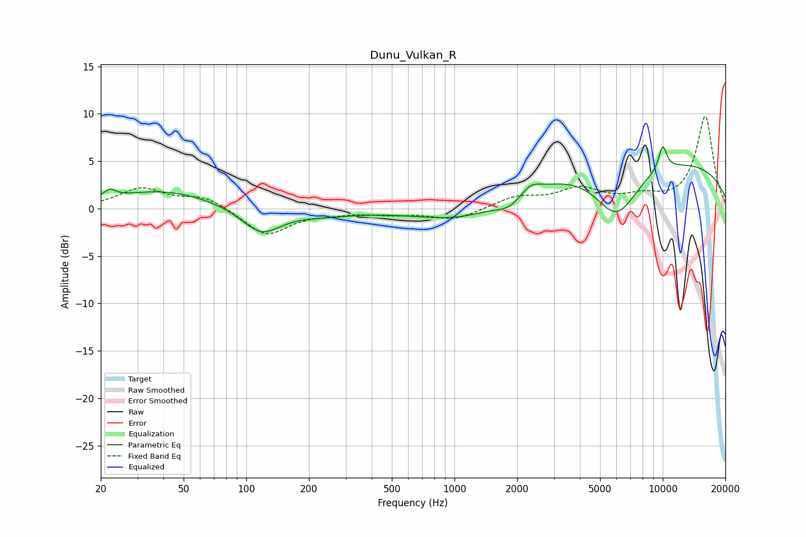

# Dunu_Vulkan_R
See [usage instructions](https://github.com/jaakkopasanen/AutoEq#usage) for more options and info.

### Parametric EQs
Apply preamp of -6.6 dB when using parametric equalizer.

|   # | Type    |   Fc (Hz) |    Q |   Gain (dB) |
|-----|---------|-----------|------|-------------|
|   1 | Peaking |        22 | 4.97 |         0.8 |
|   2 | Peaking |        40 | 0.58 |         1.9 |
|   3 | Peaking |       118 | 1.49 |        -2.8 |
|   4 | Peaking |       237 | 0.9  |        -0.6 |
|   5 | Peaking |      1137 | 0.64 |        -2.1 |
|   6 | Peaking |      1824 | 2.25 |        -1.1 |
|   7 | Peaking |      2322 | 3.36 |         0.9 |
|   8 | Peaking |      6008 | 1.34 |        -5.4 |
|   9 | Peaking |      8333 | 0.18 |         5.3 |
|  10 | Peaking |     10000 | 6    |         2.6 |

### Fixed Band EQs
When using fixed band (also called graphic) equalizer, apply preamp of **-9.8 dB** (if available) and set gains manually with these parameters.

|   # | Type    |   Fc (Hz) |    Q |   Gain (dB) |
|-----|---------|-----------|------|-------------|
|   1 | Peaking |        31 | 1.41 |         2.1 |
|   2 | Peaking |        62 | 1.41 |         1.3 |
|   3 | Peaking |       125 | 1.41 |        -2.8 |
|   4 | Peaking |       250 | 1.41 |        -0.3 |
|   5 | Peaking |       500 | 1.41 |        -0.5 |
|   6 | Peaking |      1000 | 1.41 |        -1.2 |
|   7 | Peaking |      2000 | 1.41 |         1.2 |
|   8 | Peaking |      4000 | 1.41 |         1.9 |
|   9 | Peaking |      8000 | 1.41 |         1   |
|  10 | Peaking |     16000 | 1.41 |         9.7 |

### Graphs

