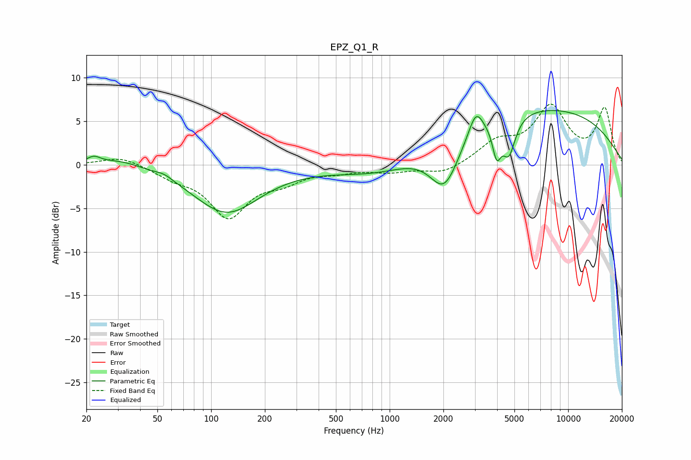

# EPZ_Q1_R
See [usage instructions](https://github.com/jaakkopasanen/AutoEq#usage) for more options and info.

### Parametric EQs
Apply preamp of -6.3 dB when using parametric equalizer.

|   # | Type    |   Fc (Hz) |    Q |   Gain (dB) |
|-----|---------|-----------|------|-------------|
|   1 | Peaking |        22 | 3.64 |         0.8 |
|   2 | Peaking |        32 | 1.16 |         0.8 |
|   3 | Peaking |        55 | 2.83 |         0.5 |
|   4 | Peaking |       122 | 0.77 |        -5.5 |
|   5 | Peaking |       914 | 0.6  |        -1.8 |
|   6 | Peaking |      2029 | 1.68 |        -5.8 |
|   7 | Peaking |      3040 | 3.54 |         2.8 |
|   8 | Peaking |      3977 | 5.89 |        -3.6 |
|   9 | Peaking |      4652 | 3.79 |        -4.3 |
|  10 | Peaking |      6422 | 0.23 |         6.7 |

### Fixed Band EQs
When using fixed band (also called graphic) equalizer, apply preamp of **-7.0 dB** (if available) and set gains manually with these parameters.

|   # | Type    |   Fc (Hz) |    Q |   Gain (dB) |
|-----|---------|-----------|------|-------------|
|   1 | Peaking |        31 | 1.41 |         1   |
|   2 | Peaking |        62 | 1.41 |        -1.2 |
|   3 | Peaking |       125 | 1.41 |        -5.7 |
|   4 | Peaking |       250 | 1.41 |        -1.5 |
|   5 | Peaking |       500 | 1.41 |        -0.6 |
|   6 | Peaking |      1000 | 1.41 |        -0.7 |
|   7 | Peaking |      2000 | 1.41 |        -1.1 |
|   8 | Peaking |      4000 | 1.41 |         2.3 |
|   9 | Peaking |      8000 | 1.41 |         6.3 |
|  10 | Peaking |     16000 | 1.41 |         6.3 |

### Graphs

