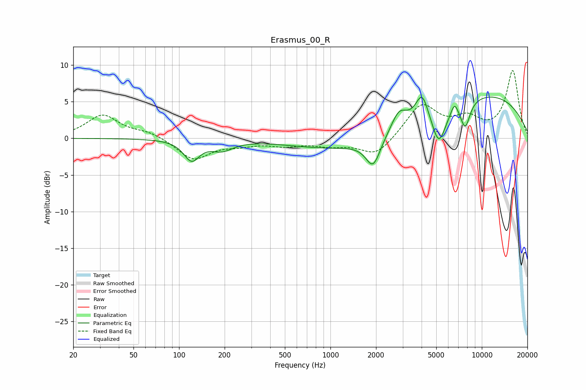

# Erasmus_00_R
See [usage instructions](https://github.com/jaakkopasanen/AutoEq#usage) for more options and info.

### Parametric EQs
Apply preamp of -5.7 dB when using parametric equalizer.

|   # | Type    |   Fc (Hz) |    Q |   Gain (dB) |
|-----|---------|-----------|------|-------------|
|   1 | Peaking |       121 | 2.75 |        -2.8 |
|   2 | Peaking |       192 | 1.95 |        -1.3 |
|   3 | Peaking |      1914 | 2.93 |        -3.8 |
|   4 | Peaking |      2050 | 0.3  |        -2.5 |
|   5 | Peaking |      2837 | 2.73 |         2.6 |
|   6 | Peaking |      4027 | 3.46 |         3.6 |
|   7 | Peaking |      5204 | 2.96 |        -5   |
|   8 | Peaking |      6601 | 6    |         1.5 |
|   9 | Peaking |      7770 | 4.12 |        -3.7 |
|  10 | Peaking |      8729 | 0.26 |         6.6 |

### Fixed Band EQs
When using fixed band (also called graphic) equalizer, apply preamp of **-9.4 dB** (if available) and set gains manually with these parameters.

|   # | Type    |   Fc (Hz) |    Q |   Gain (dB) |
|-----|---------|-----------|------|-------------|
|   1 | Peaking |        31 | 1.41 |         3.1 |
|   2 | Peaking |        62 | 1.41 |         0.8 |
|   3 | Peaking |       125 | 1.41 |        -2.9 |
|   4 | Peaking |       250 | 1.41 |        -0.7 |
|   5 | Peaking |       500 | 1.41 |        -0.8 |
|   6 | Peaking |      1000 | 1.41 |        -0.8 |
|   7 | Peaking |      2000 | 1.41 |        -2.5 |
|   8 | Peaking |      4000 | 1.41 |         4.6 |
|   9 | Peaking |      8000 | 1.41 |         2.3 |
|  10 | Peaking |     16000 | 1.41 |         9.2 |

### Graphs

